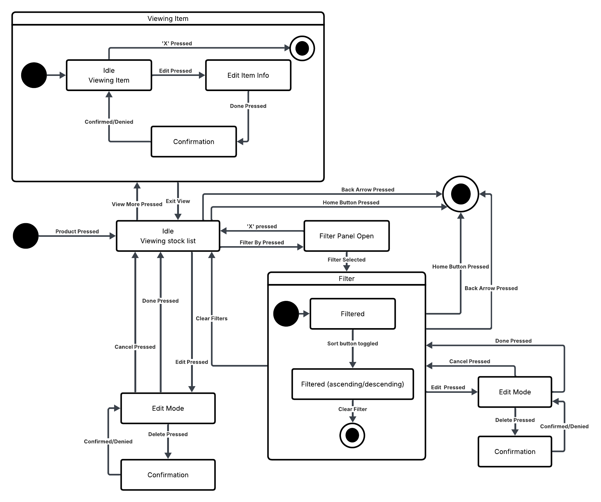

= State Machine Diagram for Product Stock Feature
Author: Jorge L. De León Orama
:toc:
:sectnums:

This document presents the state machine diagram for the Product Stock Feature and describes every discrete state the feature can be in, the events that trigger transitions between those states, and the guards or actions associated with each transition.

The diagram follows the predefined product stock sequence diagram and mockups, found within `doc/2-descriptive/domain-description/events/product-stock/`, to ensure all possible states are covered and remain consistent with the existing documentation.

== Overview

The Product Stock Feature can be organized into two groups of states: screen-level states, which represent the primary views of the stock list, and modal/overlay states, which are layered on top of a screen-level state when the user interacts with an individual stock item or a destructive action.

== Screen-Level States

=== Idle — Viewing Stock List

The default state of the feature. The user is viewing the scrollable list of stock entries for a selected product. The header displays the product summary card and the Edit toggle button. No filter is applied and no modal is open.

*Entry:* Product pressed on the Core Inventory Page → system fetches product stock → screen renders.

*Exit triggers:*

* Edit Pressed → transitions to <<edit-mode>>
* Filter By Pressed → transitions to <<filter-panel-open>>
* View More Pressed (via three-dots menu) → transitions to <<viewing-item>>
* Back Arrow Pressed → navigates to Core Inventory Page (terminal)
* Home Button Pressed → navigates to Home Page (terminal)

=== Filter Panel Open

The filter bottom sheet is open. The stock list is visible behind it but not interactive. The available options are Expiration Date and Clear Filters.

*Entry:* Filter By button tapped from Idle.

*Exit triggers:*

* Expiration Date selected → transitions to <<filter-composite>> (Filtered sub-state, ascending by default)
* 'X' Pressed / tap outside → returns to Idle

=== Filter (Composite State) [[filter-composite]]

A composite state containing two sub-states that represent an actively filtered stock list. Entered when a filter criterion is selected from the Filter Panel.

*Entry action:* Apply selected filter; re-render stock list.

*Exit trigger (from either sub-state):*

* Clear Filters → returns to Idle
* Back Arrow Pressed → navigates to Core Inventory Page (terminal)
* Home Button Pressed → navigates to Home Page (terminal)

==== Filtered (Ascending)

The initial sub-state of the Filter composite. The stock list is sorted by expiration date in ascending order. The Filter by button label updates to reflect the active filter (e.g., Filter by: Expiration).

*Exit trigger:*

* Sort button toggled → transitions to Filtered (Descending)

==== Filtered (Descending)

The stock list is sorted by expiration date in descending order.

*Exit trigger:*

* Sort button toggled → transitions back to Filtered (Ascending)

=== Edit Mode [[edit-mode]]

The screen is in edit mode. The header shows Cancel and Done buttons instead of the Edit toggle. Each stock entry card displays a Remove button. A + (add) button appears next to the filter controls.

*Entry:* Edit Pressed from Idle.

*Exit triggers:*

* Cancel Pressed → returns to Idle (no changes persisted)
* Done Pressed → returns to Idle (no item-level changes pending)
* Delete Pressed (on a stock entry) → transitions to <<confirmation>>
* Edit Pressed (via three-dots menu on an item) → transitions to <<edit-item-info>>

== Modal / Overlay States

These states are layered on top of a screen-level state. The underlying screen remains mounted but is not interactive while a modal is open.

=== Viewing Item [[viewing-item]]

A read-only modal overlay displaying the full details of a selected stock entry. Accessible from any screen-level state via the three-dots menu → View More.

*Content displayed:*

* Stock item ID (modal title)
* Product photo
* Note field (read-only)
* Expiration Date (read-only)
* Edit button (bottom-right)

*Entry:* View More Pressed from the three-dots menu.

*Exit triggers:*

* Back Arrow / 'X' Pressed → returns to the underlying screen-level state
* Edit Pressed → transitions to <<edit-item-info>> (entry path: via View More)

=== Edit Item Info [[edit-item-info]]

An editable modal overlay pre-populated with the current details of the selected stock entry. Reachable from two distinct entry paths, which determine the return transition on exit.

*Content displayed:*

* Stock item ID (modal title, not editable)
* Product photo
* Note field (editable)
* Expiration Date field (editable)
* Cancel button (bottom-left)
* Done button (bottom-right)

*Entry path A — via three-dots menu Edit:* Opened directly from the three-dots context menu.

*Entry path B — via View More:* Opened by pressing Edit inside the <<viewing-item>> modal.

*Exit triggers:*

* Done Pressed [entry path A] → persists changes → returns to underlying screen-level state
* Done Pressed [entry path B] → persists changes → returns to <<viewing-item>>
* Cancel Pressed [entry path A] → discards changes → returns to underlying screen-level state
* Cancel Pressed [entry path B] → discards changes → returns to <<viewing-item>>

=== Confirmation [[confirmation]]

A confirmation dialog overlaying Edit Mode. Displayed when the user taps Remove on a stock entry. Requires explicit user confirmation before permanently deleting the entry.

*Content displayed:*

* Confirmation message identifying the item by its ID
* NO button (left, red)
* YES button (right, green)

*Entry:* Delete Pressed from <<edit-mode>>.

*Exit triggers:*

* YES Pressed → deletes stock entry → returns to <<edit-mode>> (list updated)
* NO Pressed / Confirmed/Denied → dismisses dialog → returns to <<edit-mode>> (no change)

== Terminal States

[cols="1,2", options="header"]
|===
| Terminal state | Trigger
| Core Inventory Page | Back Arrow Pressed from any screen-level state
| Home Page           | Home Button Pressed from any screen-level state
|===

== State Summary Table

[cols="1,2,2", options="header"]
|===
| State | Type | Accessible from

| Idle — Viewing Stock List
| Screen-level
| Initial entry; Cancel/Done from Edit Mode; exit from Filter; back from Viewing Item

| Filter Panel Open
| Screen-level overlay
| Idle

| Filtered (Ascending)
| Screen-level (sub-state)
| Filter Panel Open

| Filtered (Descending)
| Screen-level (sub-state)
| Filtered (Ascending)

| Edit Mode
| Screen-level
| Idle

| Viewing Item
| Modal overlay
| Any screen-level state via three-dots → View More

| Edit Item Info
| Modal overlay
| Three-dots → Edit (direct); Edit button inside Viewing Item

| Confirmation
| Modal overlay
| Edit Mode via Remove button
|===

== Deferred States

The following states are not yet defined in the current documentation and are out of scope for this diagram. They should be addressed in a follow-up issue once error handling is specified.

* Fetch failure on initial load
* Delete failure after YES confirmation in Confirmation dialog
* Save failure after Done in Edit Item Info modal