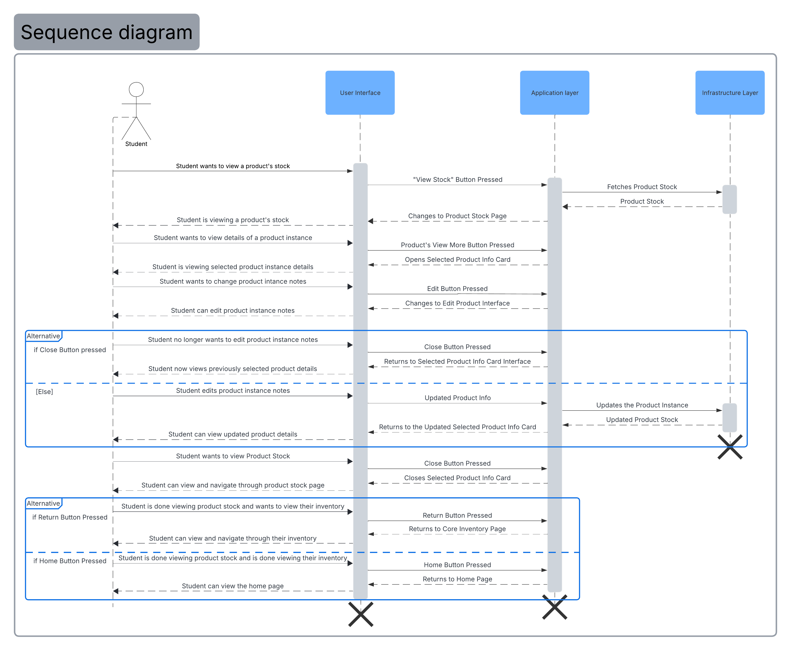

= Sequence Diagram for Product Stock Page
Author: Jorge L. De León Orama

== Overview
This document presents the sequence diagram associated with checking product stock within the inventory system. It also provides a brief explanation of the main interactions that occur when a stakeholder reviews the stock of products for a given household.

== Purpose
This sequence diagram was created to establish a clear and concrete sequence of domain-level actions involved in reviewing product stock. It helps illustrate how the stakeholder interacts with the inventory system to obtain stock information, inspect specific product entries, and manage product records associated with a household. In doing so, the diagram supports a better understanding of the Product Stock Page behavior within the broader inventory domain and helps define the functional requirements tied to stock monitoring.

== Sequence Diagram
The complete sequence diagram can be found bellow. It illustrates the interactions between the interface, application, and infrastructure layers while supporting the domain process of checking stock for household products. The diagram represents the main actions that occur when a stakeholder accesses inventory information, reviews the available stock records, and interacts with a selected product entry.

The sequence begins when the stakeholder requests to view the stock of products associated with a given household. The system then performs the necessary data retrieval operations and presents the corresponding stock information. Once the stock data is available, the stakeholder may review the details of a specific product instance, update product information when necessary, or return to a broader inventory view to continue managing household stock. In this way, the sequence diagram reflects not only system interactions, but also the domain objective of supporting accurate inventory tracking and product oversight.

