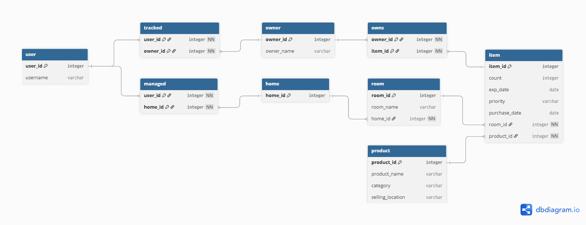
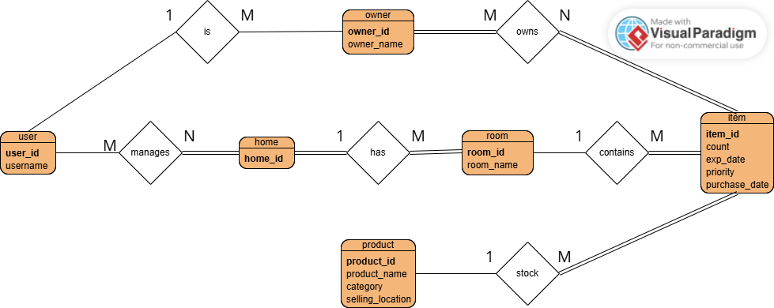

== Diagrams 

<<<<<<< HEAD
Below is an inventory of diagrams included in this section:

[cols="1,2,3", options="header"]
|===
| Type | Filename | Purpose
| Database Flow Diagram | stock_table_diagram.png | Shows backend database flows and system boundaries
| Entity-Relationship Diagram (ERD) | stock_ERD.png | Shows finalized database schema and relationships
|===

=== Database Flow Diagram

=======
=== High-Level Architecture
image::2-descriptive/implementation/diagrams/stock_table_diagram.png[]
>>>>>>> d34b854fb461d73495a6f7665ddf02360d641e92

Shows the backend's database flows and how they interact. Useful for understanding system boundaries and responsibilities.

<<<<<<< HEAD
=== Entity-Relationship Diagram (ERD)

=======
=== Final ERD
image::2-descriptive/implementation/diagrams/stock_ERD.png[]
>>>>>>> d34b854fb461d73495a6f7665ddf02360d641e92

Shows the finalized database schema including users, homes, rooms, items, products, and relationship tables. Useful for validating data structure and clarifying how features map to persistent storage.

// Add additional diagrams below as needed
