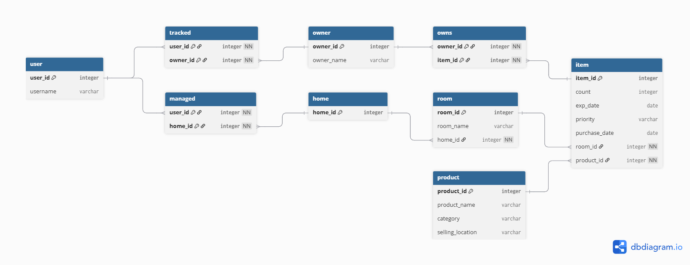
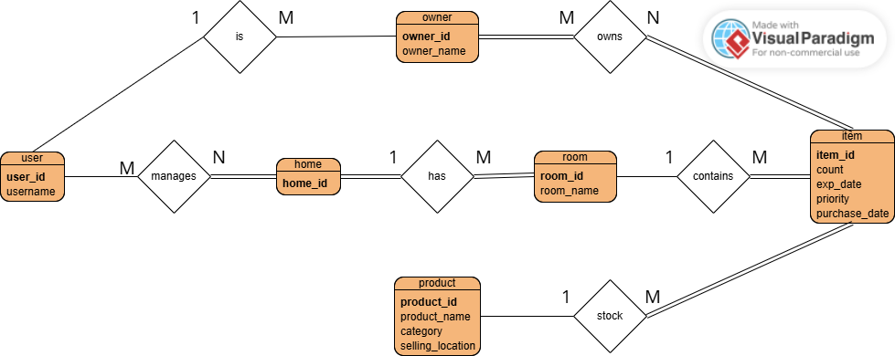
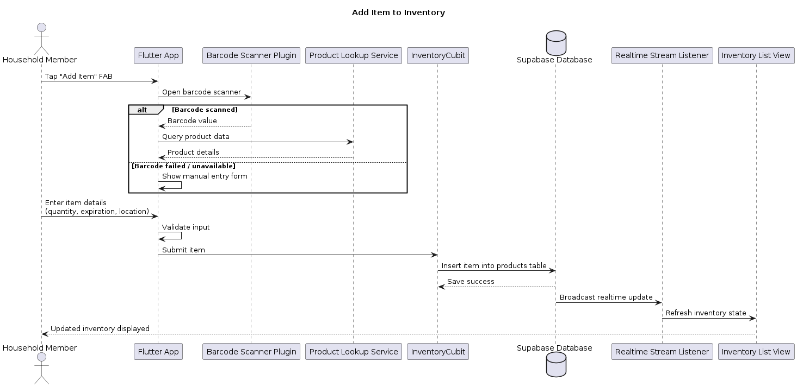
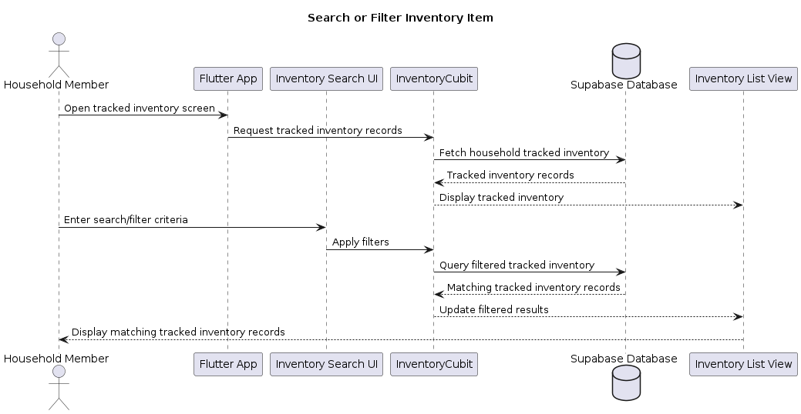
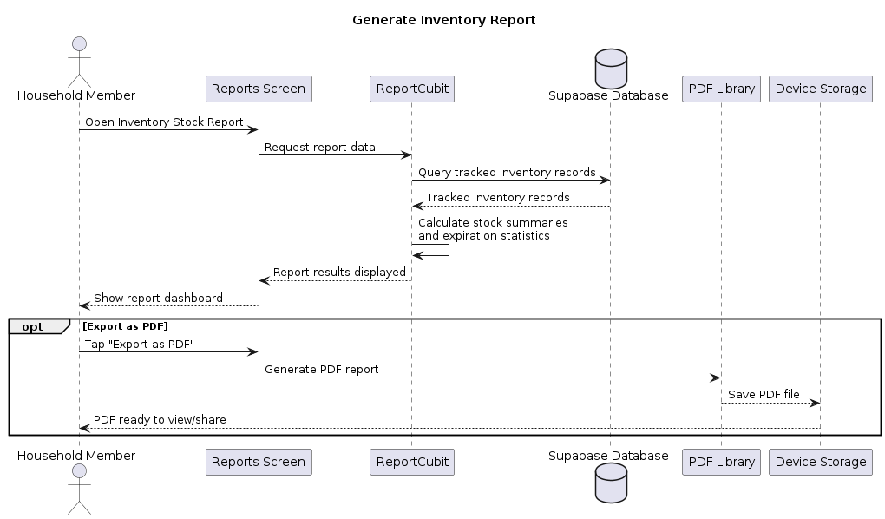

== Diagrams 

Below is an inventory of diagrams included in this section:

[cols="1,2,3", options="header"]
|===
| Type | Filename | Purpose
| Database Flow Diagram | stock_table_diagram.png | Shows backend database flows and system boundaries
| Entity-Relationship Diagram (ERD) | stock_ERD.png | Shows finalized database schema and relationships
|===

=== Database Flow Diagram

Shows the backend's database flows and how they interact. Useful for understanding system boundaries and responsibilities.

=== Entity-Relationship Diagram (ERD)

#Shows the finalized database schema including household members, households, locations, item types, item instances, tracked inventory records, and relationship tables. Useful for validating data structure and clarifying how features map to persistent storage.#

=== Sequence Diagrams for Core Workflows

#The following sequence diagrams show the main workflows implemented in the system. Each diagram includes the interaction between the household member, the Flutter application, backend services, and supporting components involved in the workflow.#

==== Add Item to Inventory

Shows the workflow for adding a new inventory item using barcode scanning or manual entry fallback. The diagram includes product lookup, validation, saving the item to Supabase, and updating the inventory list through realtime synchronization.

#*Related requirements:* US-INV-01, IR-11, DR-21, MR-08#
#*Verification references:* TC-INV-01, TC-INV-02, TC-INV-03#

==== Search or Filter Inventory Item

Shows how a household member searches or filters inventory items using criteria such as item name, category, location, ownership, stock status, or expiration status. The diagram includes the inventory UI, Cubit state management, and database queries.

#*Related requirements:* IR-10, DR-20, US-RPT-01#  
#*Verification impact:* Add UI/integration tests for inventory filters#

==== Generate Inventory Report

Shows the workflow for generating an inventory stock report and exporting it as a PDF. The diagram includes retrieving inventory data, generating report summaries, and saving the PDF file for viewing or sharing.

#*Related requirements:* US-RPT-01, IR-10#  
#*Verification references:* TC-RPT-01#

// Add additional diagrams below as needed