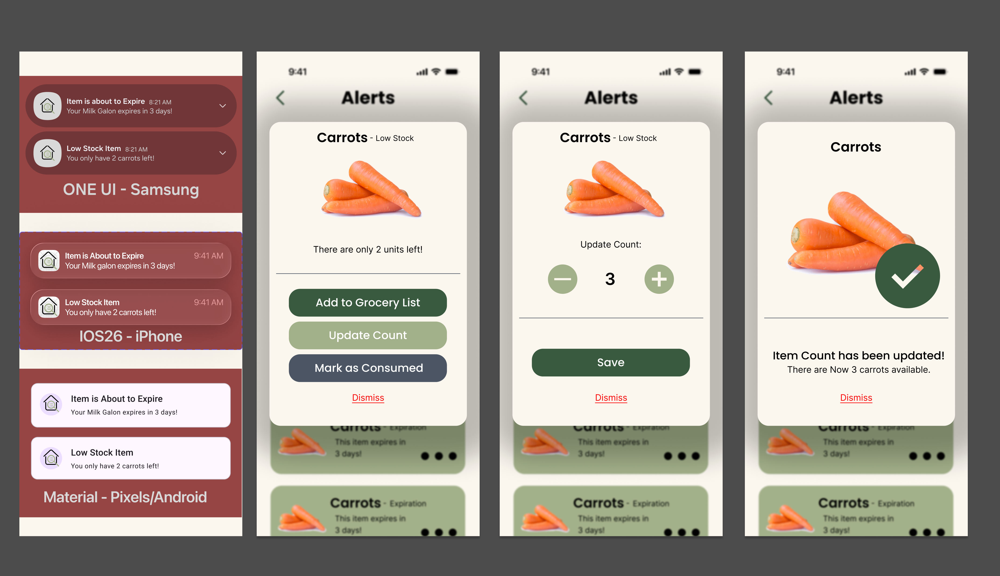

== 2.3 Implemented End-to-End Features

This section highlights the minimal viable set of high-value features that have been fully implemented in the current release. These features represent the core user journey from adding items to the inventory, receiving automated alerts, and managing restocking via the grocery list. By mapping these flows, reviewers can verify functionality without needing to compile the codebase.

=== 1. Core Inventory Management & Barcode Scanning

**User Value:** Allows household managers (e.g., **Andrea**) to quickly digitize their physical pantry without tedious manual data entry, drastically reducing the friction of app onboarding.

**End-to-End User Flow:**
1. The user navigates to the Core Inventory screen from the bottom navigation bar.
2. The user taps the floating action button to "Add Item".
3. The system opens the camera UI. The user scans a physical product's barcode.
4. The app queries the database/API. If recognized, the item details (name, brand, image) auto-populate. If unrecognized, a seamless manual entry fallback is presented.
5. The user sets the expiration date and quantity, then taps "Save".
6. The item instantly appears in the real-time synced inventory list, utilizing Flutter state management (`Bloc`/`Cubit`) and Supabase streams.

**Visual Evidence:**
[cols="1a,1a"]
|===
| image::Barcode Scanning and Manual Entry/scanner.png[Barcode Scanner UI, width=100%]
| image::screen-designs/Core-Inventory-Designs/core_inventory_mockups.png[Core Inventory List, width=100%]
|===

=== 2. Automated Expiration Alerts & Notifications

**User Value:** Prevents food waste by proactively notifying busy students (e.g., **Mateo**) before items spoil. It removes the mental burden of manually checking the fridge.

**End-to-End User Flow:**
1. A backend Supabase Edge Function (Cron Job) runs on a schedule to sweep the database for items expiring within user-defined thresholds (e.g., 3 days).
2. The system applies deduplication logic to prevent notification spam.
3. A push notification payload is delivered to the user's mobile device via Firebase Cloud Messaging (FCM) / APNs.
4. Tapping the push notification deep-links the user directly to the "Alerts Center" tab, displaying the specific items requiring immediate consumption or disposal.

**Visual Evidence:**

=== 3. Smart Grocery List Management

**User Value:** Closes the inventory lifecycle loop. When items run out, users need a frictionless way to consolidate what they need to buy and subsequently restock it.

**End-to-End User Flow:**
1. When an item's quantity is manually reduced to zero in the Core Inventory, the system automatically flags it for addition to the Grocery List.
2. The user can navigate to the "My Grocery List" tab to view auto-generated items or manually input "Custom Items".
3. While at the supermarket, the user checks off items as they place them in their physical cart.
4. Upon completing the shopping trip, checked-off items are automatically transitioned back to the Core Inventory with updated quantities and fresh expiration dates.

**Visual Evidence:**
[cols="1a,1a"]
|===
| image::../requirements/features/grocery-list/design/images/My Grocery list UI.png[My Grocery List UI, width=100%]
| image::../requirements/features/grocery-list/design/images/Add Costume item UI.png[Add Custom Item UI, width=100%]
|===