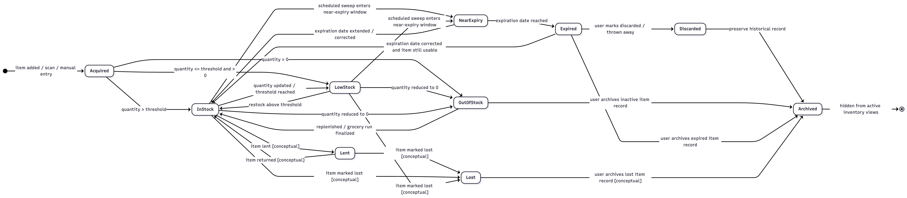
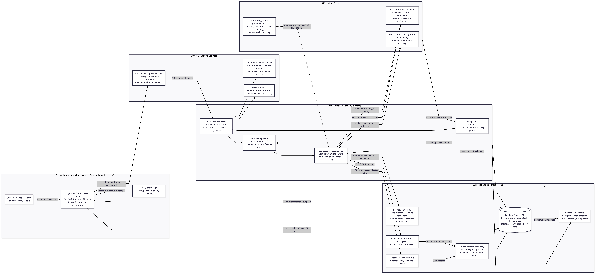
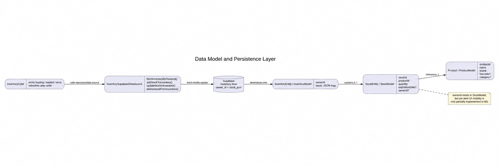
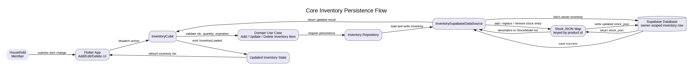

== Implemented End-to-End Features

This section documents the minimal viable set of high-value features fully implemented in the current release. For each feature, the end-to-end user flow is mapped from input through processing to output, so reviewers can verify functionality and understand core behavior without compiling or running the application.

**Status Legend:** Completed | In Progress | Planned

---

=== Feature 1: Core Inventory Management (F-INV)

**User Value:** Eliminates tedious manual data entry through quick item capture via barcode scanning with manual-entry fallback, reducing onboarding friction for household managers like Andrea.

**Primary Users:** Household managers, kitchen coordinators

**End-to-End User Flow:**

.Input / Process / Output Flow
[cols="2,3,2", options="header"]
|===
| **Input**
| **Processing**
| **Output**

| User taps "Add Item" floating action button
| System opens camera intent and initializes barcode scanner UI
| Camera preview displayed with scanning overlay

| User scans product barcode OR manually enters product name
| - Barcode detected: query product database (local cache + remote API)
- Product found: auto-populate (name, brand, image, default quantity)
- Product not found: show manual entry form fallback
| Item details form pre-filled or blank for manual entry

| User sets expiration date, quantity, location, and taps "Save"
| - Data validation (expiration date ≥ today, quantity > 0)
- Insert into Supabase `products` table
- Trigger Bloc/Cubit state update
- Stream listener broadcasts real-time update to inventory list
| Item appears instantly in Core Inventory list; list refreshes via Flutter Bloc state management

| User views inventory list (sorted by category/status)
| Supabase real-time stream continuously syncs inventory state across all connected listeners
| Live inventory display with current quantities, expiration status, and item metadata

|===

**Components Involved:**
- **Presentation:** `AddItemPage`, `InventoryPage`, `ItemForm` widgets
- **State Management:** `InventoryCubit`, `InventoryState`
- **Data Layer:** `ProductSupabaseDataSource`, `InventorySupabaseDataSource`, `ProductRepositoryImpl`
- **Domain:** `AddInventoryItem`, `GetInventoryItems` use cases
- **External:** Barcode scanner plugin, Supabase Realtime streams

**Visual Evidence:**
[cols="1a,1a"]
|===
| image::Barcode Scanning and Manual Entry/scanner.png[Barcode Scanner UI, width=100%, title="Live Barcode Scanning"]
| image::screen-designs/Core-Inventory-Designs/core_inventory_mockups.png[Core Inventory List, width=100%, title="Inventory List View"]
|===

**Key Implementation Details:**
- **Real-Time Sync:** Supabase Postgres Realtime subscriptions push updates to all clients instantly.
- **Validation:** Client-side validation ensures data integrity before submission; server-side triggers enforce constraints.
- **Barcode Fallback:** If scanning fails or is unavailable, users can manually search and select from a product catalog.
- **Category Management:** Items are auto-categorized from product metadata; users can override.
- #**User-Friendly Error Handling:** Technical exceptions (network, Supabase, validation) are mapped to actionable user-friendly messages with retry options via `InventoryErrorHandler`, not raw stack traces.#
- #**Inline Form Validation:** Real-time per-field feedback prevents invalid data before submission.#

**Completion Status:** Completed — Core add/view/edit operations fully functional; barcode scanning integrated with fallback manual entry.

==== Item Lifecycle State Diagram

The following state diagram documents how a tracked inventory item changes state after entering the system. It connects the implemented Core Inventory flow (`F-INV`) with automated stock and expiration evaluation (`F-AUTOCHECK`), alert generation (`F-ALERT`), grocery-list restocking (`F-GL-AUTO` / `F-GL-USER`), and the historical-preservation rule for archived items (`DR-3`). It focuses on item lifecycle state rather than notification lifecycle state.

Source file: `docs/2-descriptive/implementation/diagrams/item_lifecycle_state_diagram.mmd`

**Transition interpretation:**

* `Acquired` begins when a member adds an item via barcode scanning or manual entry.
* `InStock`, `LowStock`, and `OutOfStock` are availability states derived from quantity and low-stock threshold rules; quantity changes trigger state re-evaluation.
* `NearExpiry` and `Expired` are expiration states derived from the item's expiration date during scheduled checks.
* `Discarded` represents a user decision that the physical item is no longer kept or usable.
* `Archived` is a non-active record state that keeps historical references while excluding the item from active inventory views.
* `Lent` and `Lost` are conceptual: documentation recognizes outside-household and lost-item scenarios, but current implementation evidence does not show them as fully implemented states.

**Implementation alignment:** The implemented feature supports adding, editing, viewing, and quantity/expiration updates. Automated check logic evaluates low-stock, out-of-stock, near-expiry, and expired conditions, while grocery-list automation can replenish an item after shopping. Archival is the preferred preservation behavior when an item should leave active views but financial or alert history may still reference it. Conceptual states must not be presented as completed functionality until their UI, data model, and behavior are implemented and verified.

---

=== Feature 2: Automated Expiration Alerts & Notifications (F-ALERT + F-AUTOCHECK)

**User Value:** Prevents food waste by proactively alerting users before items spoil, removing the mental burden of manual fridge checks — especially for busy users like Mateo.

**Primary Users:** All household members (push notifications), household admin (alert configuration)

**End-to-End User Flow:**

.Alert Generation & Delivery Pipeline
[cols="2,3,2", options="header"]
|===
| **Input**
| **Processing**
| **Output**

| Supabase Cron job triggers daily at 08:00 UTC
| 1. Query all non-archived items in `products` table
2. Calculate days until expiration for each item
3. Apply alert thresholds (e.g., notify if expires in ≤ 3 days)
4. Deduplicate: skip items already notified in last 24h (check `alert_log`)
5. Build payload with expiring items
| List of items meeting alert criteria, ready for notification

| Alert payload generated (item name, expiration date, action URL)
| 1. Validate user FCM/APNs token availability
2. Format payload with deep link to Alerts Center
3. Send via Firebase Cloud Messaging (FCM) or Apple Push Notification service (APNs)
| Push notification delivered to user's device

| User taps push notification on mobile device
| App route handles deep link and navigates to the "Alerts Center" tab to highlight expiring items
| Alerts Center screen displays expiring items sorted by urgency, recommended actions (consume, donate, discard, extend date), and quick action buttons

| User taps "Mark as Consumed" or "Extend Expiration" for an item
| 1. Mark Consumed: delete or reduce quantity to 0
2. Extend: show date picker, update expiration date
3. Trigger state update via Bloc
4. Log action in `alert_log` to prevent duplicate notifications
| Item removed from or updated in inventory; alert cleared; confirmation shown

|===

**Components Involved:**
- **Backend:** Supabase Cron Edge Function (TypeScript), Postgres triggers
- **Frontend Presentation:** Alerts Center screen, push notification handler
- **State Management:** Alert Cubit (if implemented) or real-time stream listener
- **Data Layer:** Alert repository, alert log data source
- **Domain:** `AutomatedCheckExpiration`, `AutomatedCheckStock` use cases
- **External:** Firebase Cloud Messaging (FCM), Apple Push Notification (APNs)

**Visual Evidence:**
[cols="1a,1a"]
|===
| image::screen-designs/Alerts-&-Notifications-Screen/images/push-notifications-flow-ui.png[Push Notification Flow, width=100%, title="Push Notification & Deep Link"]
| image::screen-designs/Alerts-&-Notifications-Screen/images/alerts-tab-flow-ui.png[Alerts Tab Flow, width=100%, title="Alerts Tab & Center Screen"]
|===

**Key Implementation Details:**
- **Deduplication Logic:** An alert log in Supabase prevents notification spam; the same item is not re-notified within 24 hours unless status changes.
- **Threshold Flexibility:** Thresholds are configurable per household (e.g., 7-day vs 1-day warnings).
- **Timezone Handling:** The cron job runs in UTC; expiration comparison uses the user's local timezone.
- **Offline Handling:** If the user is offline, Android/iOS queues the notification locally and displays it on reconnect.

**Completion Status:** Completed — Alert generation, deduplication, and notification dispatch fully implemented; Alerts screen integrated with deep-link handling.

---

=== Feature 3: Smart Grocery List Management (F-GL-AUTO + F-GL-USER)

**User Value:** Closes the inventory lifecycle loop — auto-generates shopping lists from inventory state, then enables quick shopping-trip management (check off items, restock on return).

**Primary Users:** Shoppers, household managers

**End-to-End User Flow:**

.Grocery List Generation & Trip Management
[cols="2,3,2", options="header"]
|===
| **Input**
| **Processing**
| **Output**

| Automated daily check (Feature 2) runs and identifies inventory gaps
Example: Milk quantity = 0, Bread expired 2 days ago, Pasta below threshold
| 1. Process AutoCheck output (OUT_OF_STOCK, EXPIRED, LOW_STOCK)
2. Apply priority order: (1) OUT_OF_STOCK, (2) EXPIRED, (3) LOW_STOCK, (4) frequently used + low/out
3. Skip items already on the active grocery list
4. Log auto-additions to `grocery_list_log`
| Grocery list auto-updated with prioritized items (e.g., Milk [OUT_OF_STOCK], Bread [EXPIRED])

| User navigates to "My Grocery List" screen
| App fetches active list from Supabase; displays items grouped by category with options to mark "in cart", edit quantity/notes, remove, or add a custom item
| Grocery list displayed with auto-generated items plus user-added custom items

| User checks off items at the supermarket, then taps "Finalize Grocery Run"
| 1. For each checked item: prompt for quantity bought (default = inventory gap) and expiration date (if perishable)
2. Collect optional receipt info (total spent, payment method)
3. Validate entries
| Confirmation form shown for final quantity/expiration entry

| User confirms and taps "Save & Restock"
| 1. Update/insert each item into Core Inventory with new quantities and expiration dates
2. Clear checked items from the grocery list (or archive)
3. Log restocking action in `grocery_list_log`
4. Trigger inventory state update (Bloc)
| Updated inventory displayed; grocery list cleared of checked items; confirmation shown

|===

**Components Involved:**
- **Presentation:** `MyGroceryListPage`, `GroceryListTile`, `AddCustomItemPage` widgets
- **State Management:** `GroceryListCubit` (if implemented) or stream-based updates
- **Data Layer:** Grocery list repositories and data sources, expense tracking
- **Domain:** Grocery list use cases for generation and update
- **Auto-Generation:** Scheduled function running daily AutoCheck output processing

**Visual Evidence:**
[cols="1a,1a,1a"]
|===
| image::../requirements/features/grocery-list/design/images/My Grocery list UI.png[My Grocery List, width=100%, title="Grocery List View"]
| image::../requirements/features/grocery-list/design/images/Add Costume item UI.png[Add Custom Item, width=100%, title="Add Custom Item"]
| image::../requirements/features/grocery-list/design/images/My Grocery list Action List UI.png[Shopping Checkout, width=100%, title="Finalize & Restock"]
|===

**Key Implementation Details:**
- **Priority Queue:** Auto-generation respects priority order to avoid overwhelming users.
- **Prevent Duplicates:** Items already on the active list are not re-added by AutoCheck.
- **Custom Items:** Users can manually add items not in the product database (e.g., "Olive Oil").
- **Quantity Flexibility:** When restocking, users can adjust quantities to actual needs.
- **Expense Integration:** Optional capture of spending per trip (supports budgeting).

**Completion Status:** Completed — Auto-generation via priority queue, user review/edit flow, and restocking (update to core inventory) all implemented.

---

=== Feature 4: Shared Inventory & Household Management (F-SHARING)

**User Value:** Enables multiple household members to collaborate on inventory and see shared items, roles, and responsibilities.

**Primary Users:** All household members

**Current Status:**
- Household creation & member invitation: Implemented
- Role-based item visibility: In Progress
- Shared vs. personal items: In Progress

**End-to-End User Flow (As Currently Implemented):**

.Household Setup & Member Invitation
[cols="2,3,2", options="header"]
|===
| **Input**
| **Processing**
| **Output**

| User creates a new household during onboarding (enters name, description)
| 1. Validate input (non-empty name, max 100 chars)
2. Insert into `households` table with user as owner
3. Create initial role assignment (user = OWNER)
4. Initialize household settings (notification preferences, etc.)
| Household created; user becomes owner; household ID returned

| Owner opens Settings → Invite Members (enters roommate email, role: MEMBER/ADMIN/VIEWER)
| 1. Generate unique invite token
2. Send email with invite link + token
3. Store invite record in `invitations` table
4. Log invitation action
| Invite email sent with deep link to accept/decline

| Roommate taps invite link; invitation screen shows household name, owner, role, permissions; taps "Accept"
| 1. Validate invite token (not expired, not used)
2. Create user in `household_members` table with the role
3. Mark invitation accepted
4. Trigger Bloc update for household members list
| Roommate added to household; can see shared items; confirmation shown

|===

**Components Involved:**
- **Presentation:** Household settings, invite screen, member list view
- **State Management:** Household Cubit (if implemented)
- **Data Layer:** Household repositories, invitation data source
- **Domain:** Household management use cases
- **External:** Email service for invitations

**Visual Evidence:**
[cols="1,1"]
|===
| image::Invite-Roomate-Screen-UI/invite_roommates_mockup.png[Invite Roommates, width=100%, title="Send Invite UI"]
| image::View-roommate-invitation-screen/invitation_acceptance_mockup.png[Accept Invite, width=100%, title="Accept Invite UI"]
|===

**Completion Status:** In Progress — Household creation and member invitation fully implemented; role-based item filtering and shared vs. personal item logic progressing.

---

=== Feature 5: Reporting & Insights (F-SPEND / Reports)

**User Value:** Provides visibility into spending patterns, inventory trends, and usage analytics to support budget awareness and meal planning.

**Primary Users:** Household managers, budget-conscious users

**Current Implemented Reports:**
1. **Inventory Stock Report** — Items by category, stock levels, expiration status
2. **Expenditure Report** — Spending summary by time period, household member

**End-to-End User Flow (Stock Report):**

.Inventory Stock Report Generation
[cols="2,3,2", options="header"]
|===
| **Input**
| **Processing**
| **Output**

| User opens Reports → Inventory Stock Report (optional date range)
| 1. Query `products` table for all household items
2. Calculate stock levels (full, halfway, low, empty)
3. Identify expiring items (next 7 days)
4. Group by category
5. Generate summary stats (total items, critical items, etc.)
| Report view with summary cards (total items, by stock level, expiring count) and a grouped table (category, items, stock status)

| User taps a category to expand
| Filter/expand logic in UI
| Items in category displayed with details (quantity, threshold, expiration)

| User taps "Export as PDF"
| 1. Fetch data
2. Render PDF using the `pdf` library with charts/tables
3. Save to device storage
| PDF file generated and ready to share/print

|===

**Components Involved:**
- **Presentation:** Report screens, charts/tables, PDF preview
- **State Management:** Report Cubit
- **Data Layer:** Report repositories
- **Domain:** Report generation use cases
- **External:** PDF library, file sharing APIs

**Completion Status:** In Progress — Basic stock reports implemented; expenditure reports and analytics progressing.

---

=== Summary Table: MVP Feature Completion

[cols="1,3,1,2", options="header"]
|===
| **Feature ID**
| **Feature Name**
| **Status**
| **Key Components**

| F-INV
| Inventory Management (Add/View/Edit items)
| Completed
| #AddItemPage, InventoryCubit, ProductDataSource, Barcode Scanner, Error Handling Utilities#

| F-ALERT
| Alert Generation & Notifications
| Completed
| AlertsCenterScreen, FirebaseMessaging, Supabase Cron, DeepLink Handler

| F-AUTOCHECK
| Automated Daily Inventory Check
| Completed
| AutoCheckFunction (Edge), Threshold Logic, Notification Dispatch

| F-GL-AUTO
| Auto-Generated Grocery List
| Completed
| GroceryListGeneration (Scheduled), Priority Queue, Deduplication

| F-GL-USER
| Grocery List Review & Restocking
| Completed
| MyGroceryListPage, RestockingFlow, Quantity/Expiration Input

| F-SHARING
| Shared Inventory & Household Management
| In Progress
| HouseholdSettings, InvitationFlow, RoleManagement

| F-SPEND
| Spending & Budget Reporting
| In Progress
| ReportScreens, Charts, PDF Export, ExpenseTracking

|===

---

=== Implementation Decisions and Trade-offs

This subsection documents the major implementation decisions shaping the Milestone 3 system in a lightweight ADR style, so reviewers can understand the selected approach, alternatives considered, and consequences. Current decisions are separated from planned or feature-dependent decisions whose runtime behavior is not fully implemented.

==== ADR-01: Use Flutter for the Mobile Client

**Status:** Accepted — M3 current

**Context:** The system needs a mobile-first client for inventory capture, household coordination, alerts, grocery-list workflows, reporting, barcode scanning, and eventual push handling, supporting fast UI iteration while staying maintainable across feature teams.

**Selected Option:** Flutter with Dart, using Material 3 components, GoRouter for navigation, and Bloc/Cubit for feature state.

**Alternatives Considered:** Native Android/iOS (Kotlin/Swift); React Native; a web-first responsive app.

**Rationale:** Flutter provides a single shared codebase while supporting native features (camera, file handling, push), and fits the layered screen/widget/Cubit/use-case structure feature teams use.

**Trade-offs:**
* Reduces duplicate mobile effort versus separate native apps.
* Still requires platform-specific config for camera permissions, push, builds, and signing.
* Requires consistent state-management conventions to avoid disconnected implementations.
* Platform-specific edge cases may still require Android/iOS testing.

**Related Requirements:** Core Inventory (`F-INV`), Alerts (`F-ALERT`), Grocery List (`F-GL-AUTO`/`F-GL-USER`), Reports (`F-SPEND`), barcode fallback, mobile-first usage, reviewer-accessible local execution.

==== ADR-02: Use Supabase as the Backend Platform

**Status:** Accepted — M3 current

**Context:** The system requires backend services for authentication, persistent inventory/household/member data, shared synchronization, alert and grocery-list records, reporting data, and future media storage — quick to set up during the milestone but supporting real behavior.

**Selected Option:** Supabase, including Supabase Auth, PostgreSQL, Realtime, PostgREST via the Supabase Flutter SDK, and documented support for Storage and Edge Functions.

**Alternatives Considered:** Firebase (Auth/Firestore/Functions/Storage); a custom Node.js/Express REST API; a local-only database; direct PostgreSQL hosting without Supabase services.

**Rationale:** Supabase provides a PostgreSQL-backed platform with auth, row-level authorization, realtime, storage, and serverless functions in one stack, reducing setup overhead and fitting household-scoped, SQL-based relational modeling.

**Trade-offs:**
* Accelerates development by bundling backend services.
* Creates dependence on Supabase-specific configuration, SDK behavior, RLS policies, and hosted availability.
* SQL/Postgres modeling is stronger for relational data than document-only approaches but requires careful schema and policy design.
* Some documented Supabase services remain planned, so implementation status must stay explicit.

**Related Requirements:** Persistent inventory, households, memberships, alert and grocery-list records, reporting data, realtime collaboration, authentication, and household-scoped access control.

==== ADR-03: Enforce Access Control with Supabase Auth and Row Level Security

**Status:** Accepted — M3 current / policy configuration-dependent

**Context:** Household inventory data must not be visible or modifiable by unauthorized users. With shared households, members, roles, invitations, and personal/shared records, authorization cannot rely only on frontend checks.

**Selected Option:** Supabase Auth for identity and JWT sessions, with PostgreSQL Row Level Security (RLS) policies as the database-level authorization boundary.

**Alternatives Considered:** Authorization only in Flutter UI logic; in a custom backend API layer; application-level role checks without database policies; or separate databases/tables per household.

**Rationale:** RLS places authorization close to the data, important because multiple screens and modules query shared tables. Supabase Auth supplies the authenticated identity while RLS restricts queries/mutations by identity, household membership, and role.

**Trade-offs:**
* Reduces the risk of accidental data exposure from frontend mistakes.
* Policies must be tested carefully — incorrect ones can block legitimate access or expose data.
* Debugging access issues is harder than ordinary frontend checks.
* Role-based item visibility is still in progress and must not be presented as fully completed until verified end-to-end.

**Related Requirements:** Household membership rules, invitation/membership state, shared inventory access, authentication, authorization, and protection of household-scoped data.

==== ADR-04: Store Current Inventory State Directly While Preserving Historical Meaning Separately

**Status:** Accepted — M3 current, with some audit/history behavior still evolving

**Context:** The system needs to show current inventory quickly while preserving enough history to explain changes, support alerts, avoid duplicate purchases, and avoid corrupting financial records when items are removed or archived.

**Selected Option:** Store current inventory state directly in persistent records (quantity, status, expiration, metadata, household context), treating quantity changes, alerts, grocery-list actions, and spending as related historical/supporting records where implemented or documented.

**Alternatives Considered:** Compute current quantity only by replaying all transactions; hard-delete consumed/discarded items; store only qualitative availability; or store inventory as unstructured notes.

**Rationale:** Current inventory screens, reports, alerts, and grocery automation need fast access to current state. Keeping it directly available simplifies UI updates and checks, while documentation preserves the rule that financial history must not be silently deleted on removal/archival.

**Trade-offs:**
* Simpler and faster for the app.
* Can drift from reality if users forget to update quantities.
* Historical traceability requires disciplined logging; documentation should not imply complete audit coverage where not implemented.
* Soft deletion/archival is preferred over hard deletion when other records may reference an item.

**Related Requirements:** Core Inventory (`F-INV`), low/out-of-stock checks, expiration status, dashboard/report generation, grocery restocking, non-negative quantity rules, and `DR-3` financial immutability.

==== ADR-05: Use Bloc/Cubit for Feature State Management

**Status:** Accepted — M3 current

**Context:** The Flutter client needs predictable state handling for inventory loading, validation, success/error feedback, report views, alert interactions, grocery-list screens, and auth-dependent routes.

**Selected Option:** `flutter_bloc` with Cubit classes for feature-level state.

**Alternatives Considered:** Local widget `setState` only; Provider; Riverpod; Redux-style global state; or direct Supabase calls from widgets.

**Rationale:** Cubit is a lightweight pattern fitting the project scale, keeping widgets focused on rendering while moving behavior into state classes, Cubits, use cases, and repositories — supporting testing and avoiding backend calls in screens.

**Trade-offs:**
* Simpler than full Bloc but still requires consistent UI/state/domain/data separation.
* Simple screens may feel heavier than local widget state.
* Inconsistent per-team Cubit implementations can cause drift.
* Error/loading states must be modeled explicitly to avoid silent failures.

**Related Requirements:** Reliable UI behavior for Core Inventory, Reports, Alerts, Grocery List, auth flow, error handling, and reviewer-verifiable behavior.

==== ADR-06: Use Supabase Realtime for Shared Inventory Synchronization

**Status:** Accepted — M3 current / feature-dependent

**Context:** Shared household inventory loses value if users must manually refresh to see roommates' changes; the system needs to keep inventory and household views reasonably current across devices.

**Selected Option:** Supabase Realtime subscriptions to receive PostgreSQL change events and update Flutter client state.

**Alternatives Considered:** Manual refresh only; periodic client polling; a custom WebSocket server; or push notifications for every shared change.

**Rationale:** Realtime integrates with the selected backend and supports live updates without maintaining a custom sync server, fitting the shared-household use case where multiple users add, edit, or consume items.

**Trade-offs:**
* Reduces manual refresh needs.
* Depends on Supabase configuration, table replication, RLS policies, and client subscription handling.
* Can create UI churn or race conditions if mutations also trigger full reloads.
* Offline conflict handling is a separate concern not solved by Realtime alone.

**Related Requirements:** Shared inventory coordination, household visibility, reduced duplicate purchases, realtime list refresh, and synchronization requirements.

==== ADR-07: Use Scheduled Backend Checks for Expiration and Stock Automation

**Status:** Accepted — documented / partially implemented

**Context:** Low-stock, out-of-stock, near-expiry, and expired conditions should not depend on users opening the app; the system needs to evaluate conditions and produce alert or grocery-list outputs without constant interaction.

**Selected Option:** Scheduled/backend automation via a cron-style trigger and hosted/Edge Function worker to evaluate stock and expiration conditions, deduplicate alerts, record run information, and create downstream alert or grocery-list outputs.

**Alternatives Considered:** Evaluate only when the user opens the app; only after each item update; device-local background tasks only; or send alerts manually without automated checking.

**Rationale:** Scheduled backend evaluation is more reliable than depending on user behavior or local background execution, allowing checks to run even when the app is closed and centralizing deduplication and run logging.

**Trade-offs:**
* Improves reliability for reminders and grocery-list generation.
* Adds operational complexity (scheduled triggers, function deployment, privileged DB access, retries, logging, failure recovery).
* Partly documented/implemented, so verified runtime behavior must be distinguished from planned design.
* Scheduled checks must avoid repeated alerts when no meaningful state transition occurred.

**Related Requirements:** `F-AUTOCHECK`, `F-ALERT`, expiration/low-stock detection, deduplication/anti-spam rules, grocery-list auto-generation, and scheduled sweep reliability.

==== ADR-08: Separate Notification Records from Push Delivery

**Status:** Accepted — M3 current / push delivery setup-dependent

**Context:** The system needs to represent alerts to support in-app review, deduplication, read/dismissed state, and possible push delivery, which may depend on platform setup, FCM/APNs configuration, and device permissions.

**Selected Option:** Model alerts/notifications as persisted records, treating push delivery via FCM/APNs as a delivery mechanism rather than the source of truth.

**Alternatives Considered:** Push only with no persisted records; in-app alerts only with no push; alert state only in local client memory; or repeated push notifications directly from every automated check.

**Rationale:** Persisted records support traceability, deduplication, read/unread handling, dismissal, and in-app review, so push can be added as an additional channel without becoming the only place alert state exists.

**Trade-offs:**
* Improves reliability and auditability.
* Requires additional schema/service logic for statuses (unread, read, dismissed, archived).
* Push delivery still depends on platform configuration and permissions.
* Documentation must not imply every alert record results in a delivered push.

**Related Requirements:** Actionable alert states, notification records, deduplication/anti-spam rules, Alerts Center behavior, expiration and low-stock alerts, and future platform push delivery.

==== ADR-09: Use PNG Diagram Fallbacks with Source-Renderable Mermaid Files

**Status:** Accepted — M3 documentation current

**Context:** Documentation needs diagrams that display reliably in GitHub and exported documents while remaining editable. Mermaid source aids maintenance, but rendering support varies across GitHub, AsciiDoc tooling, and exports.

**Selected Option:** Store each diagram as both a rendered PNG and a source-renderable Mermaid `.mmd` file; reference the PNG in `implementation.adoc` and include the source path.

**Alternatives Considered:** Embed Mermaid only; store only PNGs; use PlantUML only; or use external-tool screenshots with no source file.

**Rationale:** PNGs render consistently in GitHub and exports, while Mermaid source preserves diagram logic and eases future edits — satisfying the source-renderable requirement without fragile rendering.

**Trade-offs:**
* Diagram changes require updating both the `.mmd` source and the PNG export.
* Divergence between PNG and source can show inconsistent information.
* The source path must be documented for future maintainers.

**Related Requirements:** Diagram requirements for issues #647 and #648, Section 2.3 readability, reviewer accessibility, and long-term maintainability.

==== Planned / Future-Facing Decisions

The following are future-facing or not fully verified in the current M3 runtime and should not be interpreted as completed implementation unless later evidence confirms them.

[cols="2,3,3", options="header"]
|===
| Decision Area
| Planned Direction
| Reason for Deferral

| Environment configuration
| Move Supabase URL and anonymous key out of source code into `.env` or `--dart-define` configuration.
| Current M3 setup reads Supabase initialization values directly from `injection_dependencies.dart`; a more secure per-environment scheme is planned later.

| Advanced role-based item visibility
| Enforce complete shared-vs-personal item visibility through finalized membership, role, and RLS policies.
| Household creation and invitations are implemented, but role-based item filtering remains in progress.

| AI meal planning and ML expiration scoring
| Add AI/ML services for recipe suggestions, expiration risk scoring, and forecasting.
| Post-MVP future features, not part of the current M3 runtime.

| Grocery delivery integration
| Connect grocery-list output to external ordering or delivery services.
| Future-facing; depends on external provider APIs, account linking, and additional privacy/security review.
|===

=== Architecture Overview Diagram

The following architecture overview documents the major runtime containers and service boundaries for the Milestone 3 system, which follows a Flutter-client-plus-Supabase-backend architecture: the Flutter client handles presentation, routing, local interaction, validation, and feature orchestration, while Supabase provides authentication, persistence, authorization, realtime synchronization, storage support, and documented backend automation. The diagram distinguishes current M3 components from documented/future-facing ones; components marked planned must not be interpreted as fully implemented.

Source file: `docs/2-descriptive/implementation/diagrams/architecture_overview_diagram.mmd`

The diagram shows the architecture from the mobile client outward:

* **Flutter mobile client (M3 current):** Material 3 UI screens/forms, GoRouter navigation and deep-link entry points, Bloc/Cubit state management, and feature-level use cases/repositories for validation and Supabase operations.
* **Supabase client/API boundary (M3 current):** The app communicates with Supabase over HTTPS through the Supabase Flutter SDK for authentication, CRUD queries, storage access, and realtime subscriptions.
* **Authentication and authorization boundary (M3 current):** Supabase Auth issues JWT sessions; Postgres RLS policies enforce household-scoped access for authenticated users before rows are returned or modified.
* **Persistence layer (M3 current):** Supabase PostgreSQL stores inventory items, households, members, alerts, grocery-list data, report data, and related metadata.
* **Realtime synchronization (M3 current):** Supabase Realtime publishes Postgres change events to subscribed clients so inventory and household views update without manual refresh.
* **Storage support (documented feature-dependent):** Supabase Storage supports product images, receipts, and media assets where the feature uses uploaded/downloaded files.
* **Backend automation (documented / partially implemented):** Scheduled jobs and hosted/Edge Function workers support stock/expiration checks, alert generation, deduplication, run logging, and grocery restock output.
* **Device/platform services (M3 current / partially configured):** Camera and barcode scanning support item capture; local file/PDF APIs support exports; push delivery is platform-dependent via FCM/APNs.
* **External services (M3 current / planned):** Barcode/product lookup and email invitation delivery are integration-dependent; grocery delivery and AI meal planning are planned only.

---

=== Technical Stack Versions and Tooling

The component roles (Flutter client, Bloc/Cubit state management, GoRouter, Material 3, Supabase Auth/PostgreSQL/Realtime/Storage/Edge Functions, FCM/APNs, barcode lookup) are described in the Architecture Overview above. This subsection records only what that overview does not:

- **Runtime versions:** Flutter and Dart SDK versions are specified authoritatively in Section 2.2.3 (Machine Requirements).
- **Local storage:** Shared Preferences for settings and cached product data.
- **CI/CD & tooling:** Git + GitHub for version control; the Dart test framework with `mocktail` for testing; `flutter_lints` and the Dart analyzer for linting.

---

=== #Data Model and Persistence Layer#

#This section documents the current data model and persistence approach actually reflected in the codebase, rather than placeholder or outdated diagrams from earlier revisions.#

==== #Data Model Diagram#

#The diagram represents the implemented data model and persistence structure: the relationship between inventory state management, persistence operations, domain entities, and the Supabase storage model. It reflects how inventory data is retrieved, transformed, persisted, and synchronized, and documents entity ownership, inventory composition, product references, and the application/persistence interaction.#

==== #Core Implemented Entities#

[cols="1,2", options="header"]
|===
| #Entity / Model#
| #Responsibility#

| #InventoryEntity / InventoryModel#
| #Represents the inventory aggregate loaded from persistence and exposed to the application.#

| #StockEntity / StockModel#
| #Represents tracked stock information including quantity, expiration data, and ownership metadata.#

| #Product / ProductModel#
| #Represents reusable product information used during inventory operations.#

| #InventorySupabaseDataSource#
| #Handles persistence operations between the application and Supabase.#

| #InventoryCubit#
| #Coordinates inventory state updates and UI synchronization.#
|===

==== #Relationships and Ownership#

#The implementation treats inventory as an owner-scoped aggregate: each inventory belongs to one owner identifier and contains a stock JSON map keyed by product id, so one inventory can hold multiple stock entries, each associated with a product record. `StockEntity`/`StockModel` include an optional `ownerId` that supports future ownership-aware behavior, but the current implementation does not yet fully enforce per-item visibility in the presentation layer; ownership is therefore partially implemented at the model/data level rather than a completed UI access-control feature.#

==== #Persistence Strategy#

#The system uses Supabase as the persistence backend for Core Inventory. Inventory data is stored as an owner-scoped row containing a stock JSON map, using a fetch-modify-update pattern:#

. #Fetch the inventory row for the owner.#
. #Convert the stored stock JSON into `StockModel` objects.#
. #Add, replace, or remove the affected stock entry.#
. #Write the updated stock JSON map back to Supabase.#
. #Refresh the inventory state through `InventoryCubit`.#

#This supports the implemented add, edit, delete, and lookup flows and keeps persistence logic isolated in the data layer, consistent with the project's Clean Architecture structure.#

==== #Implementation Notes and Changes#

#The current implementation replaces earlier placeholder data-model descriptions with the implemented owner-scoped persistence behavior. Main reconciliation points:#

* #Inventory persistence is centered on an owner-scoped inventory aggregate.#
* #Stock entries are persisted inside a JSON map keyed by product id.#
* #`ownerId` exists in the stock model, but item-level visibility is not fully enforced in the UI.#
* #The persistence layer does not create separate transaction or audit rows for every quantity change.#
* #Concurrent writes may overwrite intermediate changes because the strategy uses fetch-modify-update without optimistic locking.#

#These limitations remain documented so the data model does not appear more complete than the implementation supports.#

---

=== Testing & Verification Strategy

Each completed feature has been verified through:

1. **Unit Tests:** Business logic (use cases, repositories) with mock data sources
2. **Widget Tests:** UI components in isolation (forms, lists, dialogs)
3. **Integration Tests:** End-to-end flows on emulator/physical device
4. **Manual QA:** Cross-device testing (Android, iOS), network conditions (offline, slow)

Example verification for F-INV (Inventory Management): add via barcode scanning; add via manual-entry fallback; edit existing item (quantity, expiration, category); delete item; real-time list refresh on another device when an item is added; validation (no negative quantities, future expiration dates).

---

=== Known Limitations & Future Work

**Current Limitations:**
1. Role-based item visibility not yet enforced (all shared items visible to all members)
2. Budget alerts not yet implemented (spending-based notifications)
3. Complex searches (filter by location, owner, expiration range) deferred to post-MVP
4. Barcode scanning limited to common products; many items require manual entry

**Future Features (Post-MVP):**
1. **AI-Powered Meal Planning:** Suggest recipes based on current inventory
2. **Smart Notifications:** ML-based expiration risk scoring (some items spoil faster than labels suggest)
3. **Inventory Forecasting:** Predict when items will run out based on consumption patterns
4. **Family Analytics:** Who consumes what, eating pattern insights
5. **Integration with grocery delivery services:** Direct ordering from grocery list

---

include::build-and-deployment-procedure.adoc[leveloffset=+1]

---