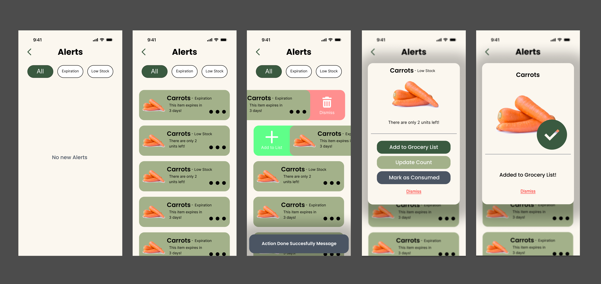
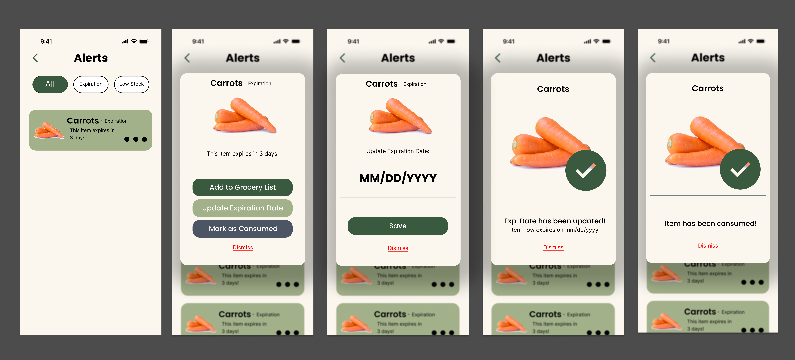

:toc: left

= #Designs for Alerts & Notifications Screen#

== #Overview#
#The Alerts & Notifications screen is designed to provide users with timely and relevant information regarding their home inventory status. This includes alerts for low inventory levels, upcoming expiration dates for perishable items, and notifications for any changes made to the inventory. The design focuses on clarity, ease of use, and quick access to important information.#

== #1. Wireframes#
#The wireframes for the Alerts & Notifications screen are structured to prioritize user experience and accessibility.#

image::images/alerts-wireframes.png[]
**#Figure 1.0.a#**: #Wireframes for Alerts & Notifications Screen#

#Seeing the wireframes from left to right in **Figure 1.0.a**, we can identify the following key components:#

    1. **#Empty Screen#**: #This screen is displayed when there are no alerts or notifications or when the user dismisses all notifications.#
    2. **#Alerts List#**: #This screen displays a list of active alerts and notifications. Each alert includes a brief description, an image and name of the item, and it is clickable to take quick actions.#
    3. **#Alerts Swipe Actions#**: #This screen shows the swipe actions available for each alert, allowing users to quickly dismiss (to the left) or add item to grocery list (to the right) directly from the alerts list.#
    4. **#Quick Actions Modal#**: #This screen appears when a user clicks on an alert, providing options to either dismiss the alert, add the item to their grocery list or update count/expiration date of the item depending on alert type.#
    5. **#Confirmation Modal#**: #This screen is displayed when a user has successfully completed an action, such as dismissing an alert or adding an item to their grocery list.#
    6. **#Editable info Modal#**: #This screen allows users to edit the details of an alert, such as quantity, or expiration date.#

== #2. User Journey High-Fidelity Designs#

#The high-fidelity designs for the Alerts & Notifications screen build upon the wireframes, incorporating visual design elements, color schemes, and typography to create a polished and user-friendly interface. They are built based on the user interaction flow showed in the mermaid diagrams.These designs aim to enhance the user experience by providing clear visual cues and intuitive navigation.#

=== #2.1. Push Notification User Journey#

[mermaid]
....
graph TD
     A([Push Notification Received]) --> B{User Action}
     B -->|Swipes away|
     C[Dismissed from OS]
     B -->|Taps Notification|
     D[App Opens]
     D --> E[Deep Link to Alert Details]
     E --> F{Choose Resolution}
     F -->|Action: Add to List|
     G[(Update Supabase DB)]
     F -->|Action: Dismiss|
     H[Alert remains Unread]
     G --> I([Show Success SnackBar])
....

**#Figure 2.1.a:#** #User flow for handling an external push notification.#

image::images/push-notifications-flow-ui.png[]
**#Figure 2.1.b:#** #High-fidelity designs for the push notification user journey.#

#Seeing the high-fidelity designs from left to right in **Figure 2.1.b**, we can identify the following key components:#

    1. **#Push Notification#**: #This is the initial notification received by the user on their device, alerting them to a specific event related to their home inventory. The designs include how the notifications will appear on different OS/UI platforms (Samsung, iOS and Android).#
    2. **#Quick Actions Modal#**: #This modal appears when the user interacts with the push notification, providing them with immediate options to address the alert.#
    3. **#Editable Info Modal#**: #This version of the editable modal allows users to update the item count in this case.#
    4. **#Confirmation Modal#**: #This modal confirms that the user's action has been successfully completed, providing feedback and reassurance.#

=== #2.2. In-App Alert Management User Journey#

[mermaid]
....
graph TD
     A([User opens App]) --> B[Navigate to Alerts Tab]
     B --> C{Active alerts?}
     C -->|No|
     D[Show Empty State UI]
     C -->|Yes|
     E[Display Alerts List]
     E --> F{Interact with Item}
     F -->|Swipe Left|
     G[Quick Action: Dismiss]
     F -->|Swipe Right|
     H[Quick Action: Add to List]
     F -->|Tap Item|
     I[Open Alert Details Modal]
     G --> J[(Update DB)]
     H --> J
....

**#Figure 2.2.a:#** #User flow for managing alerts within the app.#

**#Figure 2.2.b:#** #High-fidelity designs for the in-app alert management user journey.#

#Seeing the high-fidelity designs from left to right in **Figure 2.2.b**, we can identify the following key components:#

    1. **#Empty State UI#**: #This screen is displayed when there are no active alerts, providing a clean and informative message to the user.#
    2. **#Alerts List#**: #This screen displays all active alerts, allowing users to quickly scan through them.#
    3. **#Quick Actions#**: #These actions allow users to manage their alerts efficiently by swiping left to dismiss or swiping right to add items to their grocery list. Showing a SnackBar after the user takes an action provides immediate feedback on the success of their action.#
    4. **#Quick Actions Modal#**: #This modal provides more detailed information about a specific alert and allows users to take further actions if needed.#
    5. **#Confirmation Modal#**: #This modal confirms that the user's action has been successfully completed, providing feedback and reassurance.#

=== #2.3. Expiration Alert User Journey#

[mermaid]
....
stateDiagram-v2
     [*] --> Good_Condition: Added to Pantry
     Good_Condition --> Warning: Cron Job (Date - 3 days)
     Warning --> Expired: Cron Job (Date == Today)
     Warning --> Good_Condition: User updates date
     Warning --> [*]: User marks 'Consumed'
     Expired --> [*]: User marks 'Thrown Away'
....

**#Figure 2.3.a:#** #State transitions for an item based on expiration dates.#

**#Figure 2.3.b:#** #High-fidelity designs for the expiration alert user journey.#

#Seeing the high-fidelity designs from left to right in **Figure 2.3.b**, we can identify the following key components:#

    1. **#Expiration Alert#**: #This screen displays an alert for an item that is approaching its expiration date, providing users with a visual cue and relevant information about the item.#
    2. **#Quick Actions Modal#**: #This modal appears when the user interacts with the expiration alert, offering options to either mark the item as consumed, add to grocery list, or update the expiration date if they have more information about the item.#
    3. **#Editable Info Modal#**: #This modal allows users to update the expiration date of the item if they have consumed it or if they have thrown it away, providing flexibility in managing their inventory.#
    4. **#Confirmation Modals#**: #These modals confirm that the user's action has been successfully completed, providing feedback and reassurance.#

== #3. Conclusion#
#The designs for the Alerts & Notifications screen are centered around providing users with a seamless and efficient way to manage their home inventory. By incorporating clear visual cues, intuitive navigation, and quick access to important information, the screen aims to enhance the overall user experience and help users stay informed about their inventory status. The high-fidelity designs build upon the wireframes to create a polished and user-friendly interface that meets the needs of our target audience.#