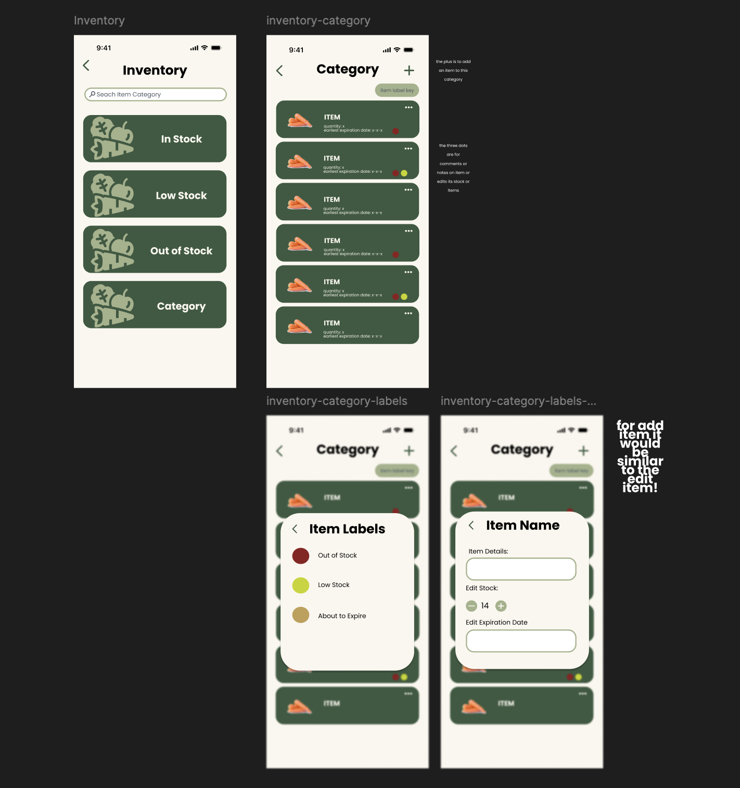

= #Core Inventory - UI Wireframes Documentation#

== #Wireframe Mockups#

== #Core Inventory - Categories Page#

=== #Purpose#

#The Categories Page is the main entry point to the inventory system. It organizes items into high-level groupings so users can quickly navigate and understand inventory status.#

=== #Features#

* #Search bar to filter categories or items#
* #Visual category cards for quick navigation#
* #Status-based and custom categories#

=== #Default Categories#

* #In Stock#
* #Low Stock#
* #Out of Stock#

=== #Custom Categories#

#Users can also organize items into:#

* #Food groups (for example: Fruits, Vegetables)#
* #General groupings (for example: Miscellaneous)#
* #Any user-defined category#

== #Core Inventory - Individual Category Page#

=== #Purpose#

#This page displays all items within a selected category, allowing users to:#

* #View item summaries#
* #Identify item status visually#
* #Access item actions quickly#

=== #Features#

* #Item list showing:#
** #Item name#
** #Quantity#
** #Expiration date#
** #Status indicator (color-coded)#
* #Quick access menu (three-dot interaction) for stock edit actions#
* #Add Item button (`+`)#

== #Item Label Key Page#

=== #Purpose#

#This page provides a legend for interpreting item status colors without overcrowding primary UI screens.#

=== #Labels#

* #Red: Out of Stock#
* #Yellow: Low Stock#
* #Brown: About to Expire#

=== #Design Rationale#

* #Keeps main screens clean and minimal#
* #Reduces repeated explanatory text#

== #Add Item Page#

=== #Purpose#

#Allows users to create and add a new item to a selected category.#

=== #Input Fields#

* #Item Name / Details#
* #Stock Quantity#
* #Increment/Decrement controls#
* #Expiration Dates#

=== #Features#

* #Simple, focused input layout#
* #Structure aligned with Edit Item page for consistency#
* #Designed for fast entry#

== #Edit Item Page#

=== #Purpose#

#Allows users to modify existing items within a category.#

=== #Features#

#Users can edit:#

* #Stock quantity#
* #Expiration date#
* #Item description/details#

=== #Advanced Interaction#

#If an item has multiple units (for example, stock quantity = `3`), users can choose which specific unit(s) to edit.#

=== #Design Notes#

* #Reuses the Add Item page layout for consistency#
* #Minimizes the learning curve#

== #Design Principles Applied#

=== #1) Minimalism#

* #Avoid unnecessary text#
* #Use visual indicators (colors, icons)#

=== #2) Progressive Disclosure#

* #Show details only when needed#
* #Keep primary screens clean#

=== #3) Consistency#

* #Add/Edit pages share structure#
* #Color system is reused across screens#

=== #4) Scalability#

* #Supports unlimited custom categories#
* #Flexible for future features#