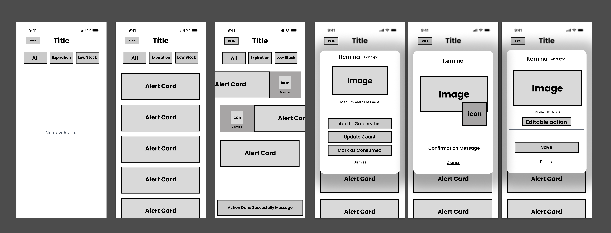
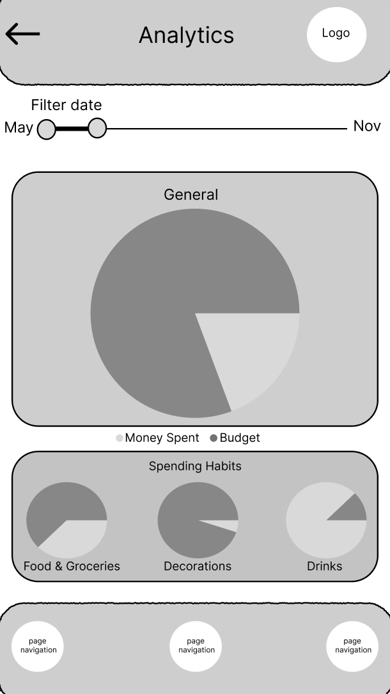

== Screen Designs
=== Key user flows
* Flow 1, Add Item to Household Inventory - User opens inventory, taps “Add Item”, enters item details like name, quantity and location, and saves. With this the team ensures fast item capture and accurate household tracking.
* Flow 2, View & Respond to Alerts - User opens the Alerts & Notifications screen, reviews low stock or expiration alerts, and dismisses or fixes them. Purpose: help users maintain inventory awareness and prevent shortages.

=== Wireframes / mockups
* Alerts & Notifications Screen: 
* Budget Spending Page: .
* Error or Empty File Icon: 
* Duplicate Warnings Icon: 

=== Usability notes
* Prioritize one handed mobile use with clear, easy to press alert items.
* Alert states must be immediately understandable.
* Use simple, recognizable icons to reduce cognitive load.
* Limit visual clutter in data heavy screens like Budget Spending.
* Provide clear dismissal or action affordances for notifications.
