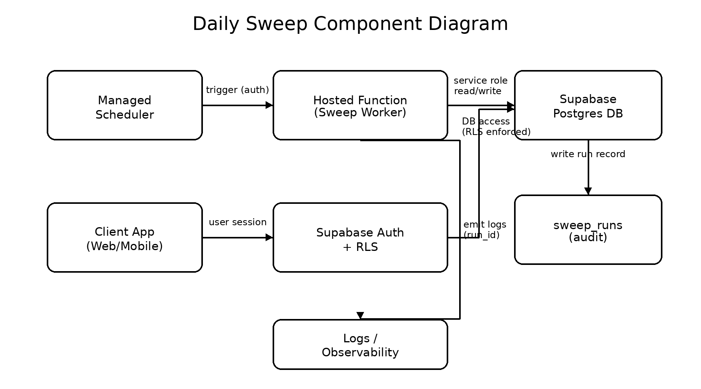
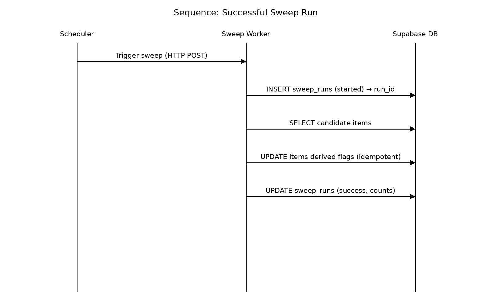
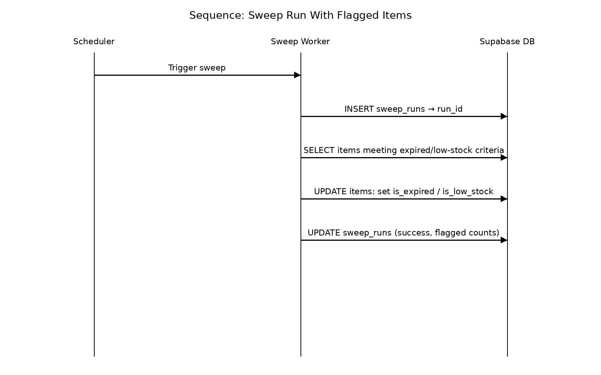
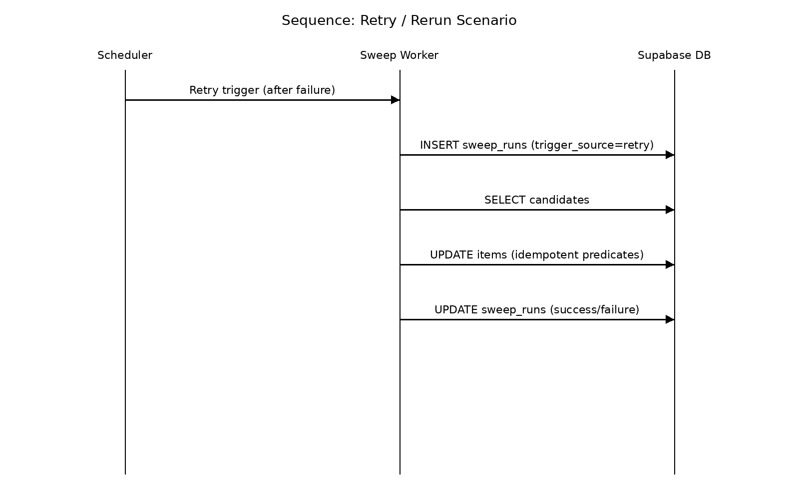

= #Daily Sweep Architecture (Expiration + Low-Stock)#
:toc:
:toclevels: 3
:sectnums:
:icons: font
:source-highlighter: rouge

// ============================================================================
// Files next to this doc:
//   sweep-component-diagram.png
//   seq-sweep-success.png
//   seq-sweep-flagged.png
//   seq-sweep-retry.png
// ============================================================================

[[purpose]]
== #Purpose and Scope#

#This document specifies the **implementation-ready architecture** for the *Daily Background Sweep* subsystem in the Digital Home Inventory project.#

#The sweep subsystem is responsible for:#

* #Detecting **expired** items (based on `expiration_date`)#
* #Detecting **low-stock** items (based on `quantity` vs `threshold`)#
* #Persisting **derived status** fields so the UI can reflect conditions without recomputation#
* #Recording each sweep execution attempt for **auditability** and later reliability monitoring#

#*Out of scope (handled in other issues):*#

* #Notification idempotency/deduplication policy (separate lecture topic task)#
* #Failure escalation policy details beyond architecture-level hooks (separate reliability doc)#

[[summary]]
== #Executive Summary#

#The Daily Sweep is triggered by a **managed scheduler** that invokes a **hosted function** (server-side worker). The worker runs with privileged access appropriate for scheduled jobs, queries relevant inventory data from Supabase Postgres, computes expired/low-stock conditions, persists derived status fields back to the database, and records a run audit entry.#

#Key properties:#

* #**Auditability:** each attempt produces a run record with timestamps, status, counts, and error summary.#
* #**Retry-safe behavior:** the sweep updates are designed to be idempotent; reruns should not corrupt state.#
* #**Clear trust boundaries:** user-scoped client operations remain under RLS; the sweep worker runs with a controlled privileged credential.#

[[architecture-overview]]
== #Architecture Overview#

#The subsystem is composed of:#

* **#Managed Scheduler#**
  *#Trigger:#* #at least once every 24 hours.#
  *#Action:#* #calls a hosted function endpoint with an authentication secret.#

* **#Hosted Function (Sweep Worker)#**
  *#Role:#* #server-side job executor.#
  *#Behavior:#* #creates run record → queries items → computes rules → persists derived status → finalizes run record.#

* **#Supabase (Auth + Postgres + Logging)#**
  *#Database:#* #source of truth for inventory and for sweep audit log (`sweep_runs`).#
  *#Auth/RLS:#* #governs user-scoped client access; sweep worker uses a privileged context (service role or dedicated DB role).#

* **#Notification Mechanism (TBD)#**
    #Notifications are not required to implement for this issue; architecture provides outputs needed for downstream notification logic (flags + run audit).#

[[diagrams]]
== #Diagrams (PNG)#

#These diagrams are stored in the same folder as this document.#

[[component-diagram]]
=== #Component Diagram#

[[seq-success]]
=== #Sequence 1 — Successful Sweep Run#

[[seq-flagged]]
=== #Sequence 2 — Sweep Run With Flagged Items#

[[seq-retry]]
=== #Sequence 3 — Retry / Rerun Scenario#

[[responsibilities]]
== #Component Responsibilities#

[cols="1,2,2",options="header"]
|===
| #Component# | #Responsibility# | #Interfaces / Dependencies#

| #Client App (Web/Mobile)#
| #CRUD inventory entities and display derived statuses (expired/low stock).#
| #Supabase Auth; Supabase client SDK; RLS policies.#

| #Supabase Auth + RLS#
| #Enforce user-scoped permissions for client operations.#
| #JWT sessions; Postgres RLS.#

| #Supabase Database (Postgres)#
| #Persist inventory state and derived fields; store sweep run audit.#
| #SQL queries/updates; indexing.#

| #Managed Scheduler#
| #Trigger the sweep periodically with secure authentication.#
| #HTTP POST to worker endpoint; secret management.#

| #Hosted Function (Sweep Worker)#
| #Execute sweep algorithm; update derived flags; write audit records.#
| #Supabase service role (or dedicated DB role); logs.#

| #Observability (logs + sweep_runs)#
| #Provide auditability and basic failure visibility.#
| #Worker logs; `sweep_runs` fields; provider logs.#
|===

[[trust-boundaries]]
== #Trust Boundaries and Permissions#

=== #User-scoped boundary (client)#
#The client app accesses only the user's permitted data using Supabase Auth and **Row Level Security (RLS)**. Any query or mutation from the UI must be authorized by RLS policies.#

=== #Service-scoped boundary (automation)#
#The sweep worker runs in a privileged context suitable for scheduled jobs. This is necessary because:#

* #The scheduler is not a logged-in end user.#
* #The sweep may need to scan multiple homes/items (depending on sharing and scope strategy).#

#**Least privilege guidance:** prefer a dedicated “sweep” role that can:#

* #`SELECT` and `UPDATE` on inventory tables required for status fields#
* #`INSERT` and `UPDATE` on `sweep_runs`#

#The scheduler-to-worker trigger must be authenticated (secret/token).#

[[data-model]]
== #Data Model Touchpoints#

#This architecture is designed to align with the project's existing domain schema (homes/rooms/items/products/owners/users). Exact column names may vary; where names differ, map them consistently.#

=== #Inventory tables (existing)#
#The sweep reads from:#

* #`items` (primary): quantity, threshold, expiration date, scope (home/room), ownership/sharing link#
* #`homes`, `rooms` (scope)#
* #`products` (optional if thresholds/metadata are product-level)#

=== #Derived status fields (expected on `items`)#
#The sweep persists status fields so UI can display without recomputation:#

* #`is_expired` (boolean)#
* #`is_low_stock` (boolean)#
* #optional: `near_expiry` (boolean) or `near_expiry_days` (integer)#
* #`status_updated_at` or reuse `updated_at` (timestamp)#

#If these fields are not present, they must be added in a later implementation task; this issue only specifies the architecture.#

=== #Proposed new audit table: `sweep_runs`#
#The architecture requires a run audit record per attempt. Minimum recommended fields:#

* #`id` (UUID, PK)#
* #`started_at` (TIMESTAMPTZ, not null)#
* #`completed_at` (TIMESTAMPTZ, nullable)#
* #`status` (TEXT: `started`, `success`, `failed`, optional `partial`)#
* #`items_scanned` (INT)#
* #`expired_flagged_count` (INT)#
* #`low_stock_flagged_count` (INT)#
* #`error_summary` (TEXT, nullable)#
* #`trigger_source` (TEXT: `cron`, `manual`, `retry`)#
* #optional: `run_scope` (TEXT/JSON; e.g., all homes vs a subset)#

#Index recommendation:#

* #`INDEX sweep_runs(started_at DESC)`#

[[queries]]
== #Expected Queries / Operations (Draft, implementation-guiding)#

#The worker should prefer **set-based** operations to minimize per-item round trips.#

=== #Run start#
* #Insert a `sweep_runs` record with status `started`.#
* #Keep a `run_id` for correlation in logs.#

=== #Sweep: expired condition#
#Rule: if `expiration_date < current_date` then `is_expired = true`.#

#Update should be **idempotent**, e.g. only flip from false/null to true when condition holds.#

=== #Sweep: low-stock condition#
#Rule: if `quantity <= threshold` then `is_low_stock = true`. Also idempotent (only change when needed).#

=== #Optional “clear flags” policy#
#Decide whether flags should be cleared when condition no longer holds (e.g., restock). If you clear flags, do it explicitly and document the policy. This architecture supports either policy; final decision should be consistent with product expectations.#

=== #Run end#
#Update `sweep_runs` to `success` (or `failed`) with counts and timestamps.#

[[indexes-performance]]
== #Indexing and Performance Notes#

#The sweep is a periodic batch read/update. To keep runtime predictable as data grows:#

* #Ensure an index exists for sweep scoping (commonly `home_id` and/or `room_id` on `items`).#
* #Ensure an index exists for `expiration_date` if used in comparisons.#
* #Keep set-based updates to reduce transaction overhead.#

#If the dataset grows significantly:#

* #Consider processing per home (iterate homes) to reduce transaction footprint and isolate failures.#

[[auditability]]
== #Auditability and Run Logging#

#The sweep subsystem must produce evidence that it ran and what it did. Minimum auditability standards:#

* #A `sweep_runs` record exists for every attempt.#
* #Each record contains:#
  * #start and end timestamps#
  * #status#
  * #scan and flagged counts#
  * #non-empty error summary on failure#
* #Worker logs include `run_id` to correlate runtime logs with DB audit.#

#Retention guidance:#

* #Keep `sweep_runs` records for 30-90 days (or longer if required for grading/audit).#
* #Avoid unbounded per-item logging unless needed; if introduced later, enforce retention.#

[[fit-criterion]]
== #Fit-Criterion Requirements (Architecture-Level)#

#These requirements are written to be objectively checkable in staging.#

*#REQ-SWEEP-001 (Schedule)#*::
#The system shall execute an automated sweep at least once every 24 hours.#

*#REQ-SWEEP-002 (Run Record)#*::
#Each sweep execution attempt shall create a `sweep_runs` record containing `started_at` and `status='started'`. On completion, the record shall contain `completed_at`, a terminal status (`success` or `failed`), and scan/flag counts.#

*#REQ-SWEEP-003 (Expired Evaluation)#*::
#For each item where `expiration_date < current_date`, the sweep shall set `items.is_expired = true`.#

*#REQ-SWEEP-004 (Low-Stock Evaluation)#*::
#For each item where `quantity <= threshold`, the sweep shall set `items.is_low_stock = true`.#

*#REQ-SWEEP-005 (Idempotent Rerun)#*::
#Rerunning the sweep without intervening changes to item quantities/thresholds/expiration dates shall not corrupt inventory state; derived status fields shall remain consistent with the rules.#

*#REQ-SWEEP-006 (Failure Recording)#*::
#On any unhandled error during sweep execution, the system shall update the associated `sweep_runs` record to `status='failed'` and store a non-empty error summary.#

[[validation]]
== #Validation Plan (Stakeholder Review)#

#A reviewer (team lead) validates correctness and completeness by confirming:#

* #Components are unambiguous (scheduler, worker, DB, auth boundary).#
* #Trust boundaries and credential use are explicitly described.#
* #Supabase touchpoints are explicit (what reads/writes happen).#
* #Diagrams match narrative.#
* #Requirements are objectively checkable and align with the described design.#
* #Retry/rerun assumptions are clearly stated.#

[[verification]]
== #Verification Plan (Staging)#

#The following staging test plan provides objective evidence that the architecture is implementable and behaves as specified.#

=== #Seed dataset#
#Create at least:#

* #Item A: expired (`expiration_date` set to yesterday)#
* #Item B: low stock (`quantity <= threshold`)#
* #Item C: normal (not expired, not low stock)#
* #Item D: no expiration date (should not be flagged expired)#

=== #Test scenarios#

[cols="1,2,2,2",options="header"]
|===
| #Scenario# | #Setup# | #Action# | #Expected Outcome#

| #Successful sweep creates run record#
| #Seed dataset exists#
| #Trigger sweep once#
| #New `sweep_runs` row exists; status terminal; counts populated#

| #Expired detection#
| #Item A expiration yesterday#
| #Trigger sweep#
| #Item A has `is_expired=true`#

| #Low-stock detection#
| #Item B quantity <= threshold#
| #Trigger sweep#
| #Item B has `is_low_stock=true`#

| #Idempotent rerun#
| #No inventory changes after prior run#
| #Trigger sweep again#
| #Derived flags remain consistent; no corrupt/oscillating state; new `sweep_runs` record created#

| #Failure recording#
| #Induce worker error (staging-only) or simulate DB failure#
| #Trigger sweep#
| #`sweep_runs.status='failed'` and `error_summary` non-empty#

| #Recovery after failure#
| #Fix error#
| #Trigger sweep again#
| #New run succeeds; derived flags correct#
|===

[[traceability]]
== #Traceability Hooks#

#This architecture supports the project goal of automated reminders/status accuracy by:#

* #Scheduled execution (REQ-SWEEP-001)#
* #Explicit rule evaluation and persistence (REQ-SWEEP-003/004)#
* #UI-ready derived state (derived flags)#
* #Reliability evidence (REQ-SWEEP-002/006)#
* #Retry-safe execution model (REQ-SWEEP-005)#

#Notification duplication prevention and detailed failure escalation policies are addressed in separate documentation tasks/issues.#