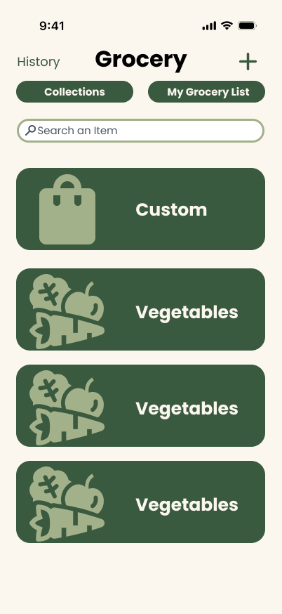
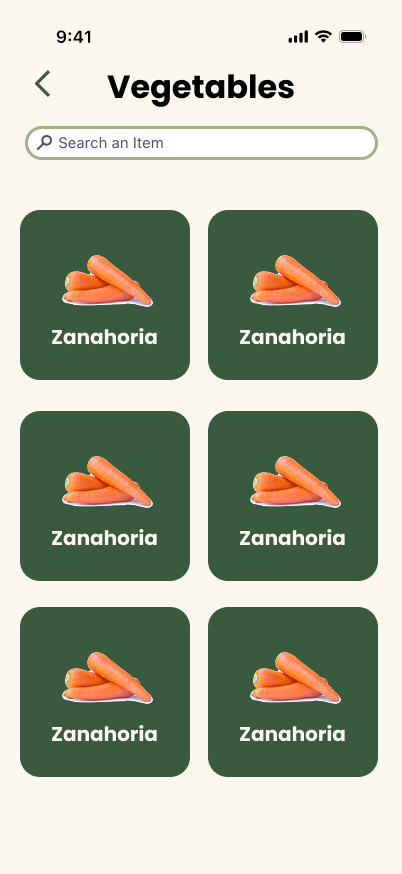
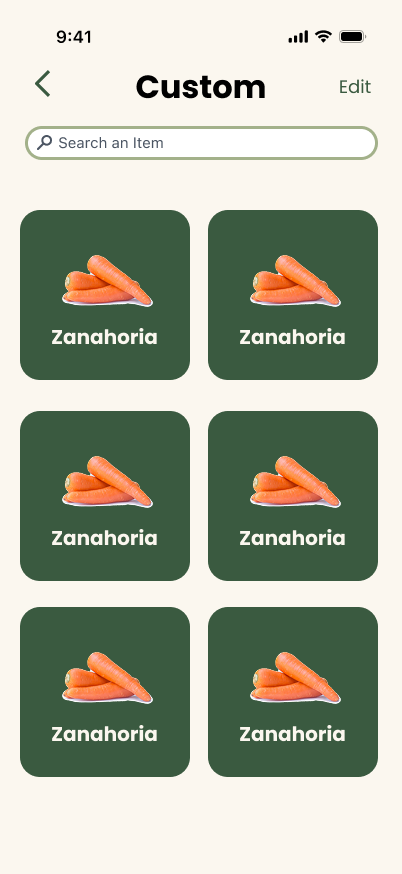
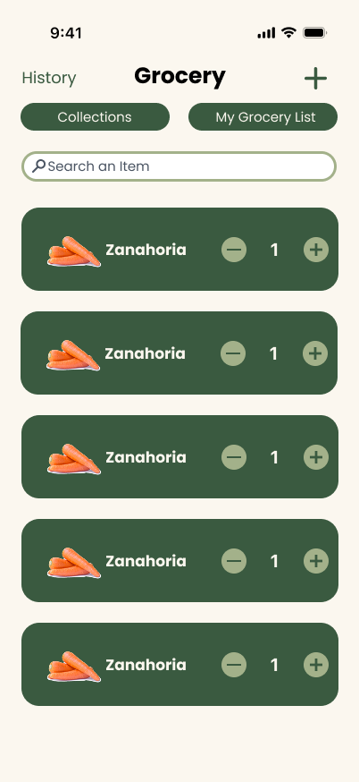
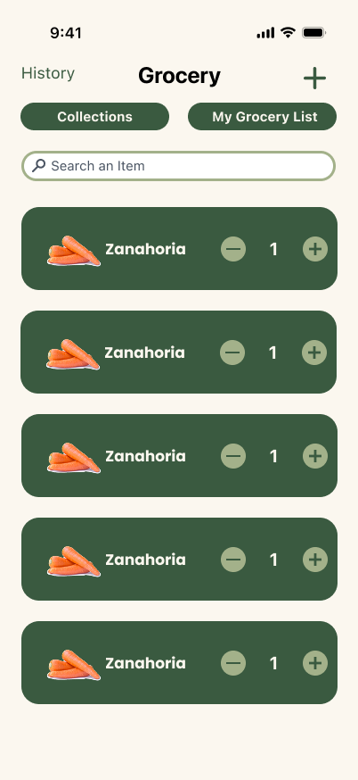
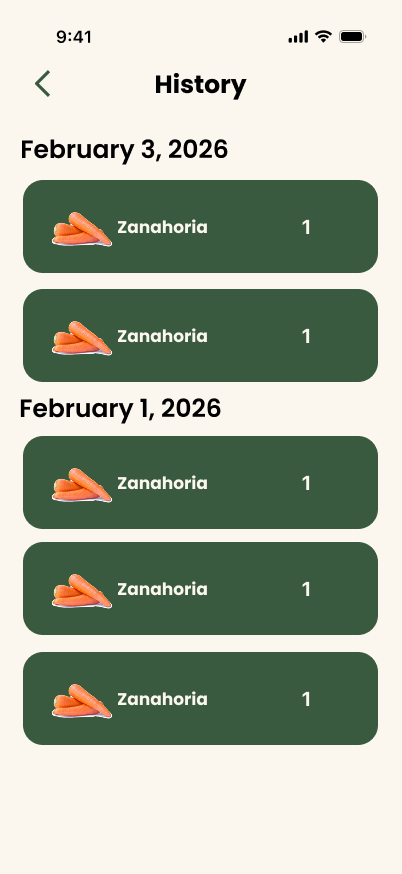
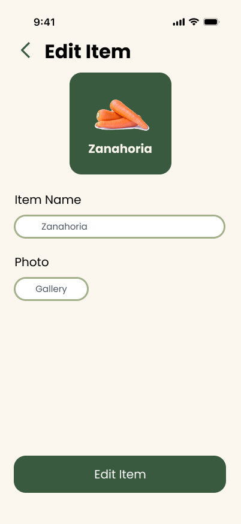
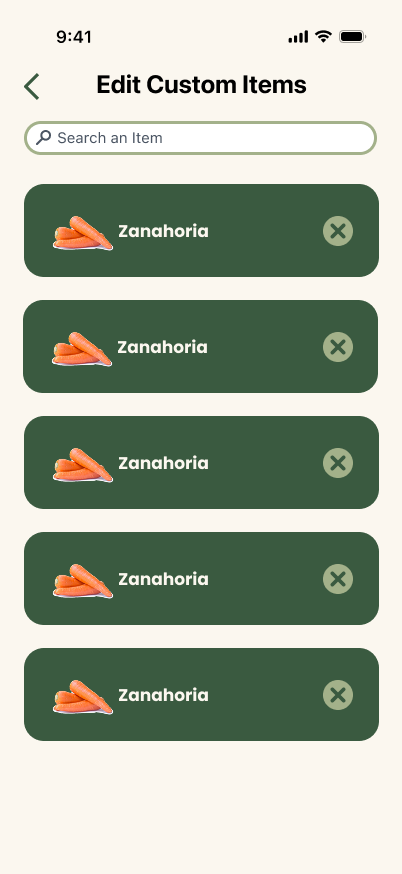

= Grocery List UI Design

== Objective

The objective of the UI design is to provide a design that is easy to use and understand. This will be used as a guide for the development of the grocery list feature front end.

== Designs 

=== Collection List Page

This is going to be the first page that the user is foing to see when they enter the grocery list feature. This page will show the user different collections of items, divided on different categories. Additionally, will be a category specially created for the custom items that the user has created. 

=== Collection Page

This page shows up when the user clicks on a collection. Here the user will be able to see all the items that are part of that category. THe different of a normal collection with the custom collection is that the custom collection will have a button to see all the items that they had created and eliminated or edit them. If the user clicks on the item, this item will be added to the grocery list. Each click is one unit of the item.

===Grocery List Page

This page shows up when the user clicks on the grocery list button. Here the user will be able to see all the items that they have added to the grocery list. The user will have have the option to add or remove unis of the item. If the item is pressed, and action list will appear with the options to set the item completed or remove the item. If the user clicks on the completed option, the item will be remove from the grocery list but added to the history. While if the user clicks on the remove option, the item will be just removed from the grocery list.

===History Page 

This page shows up when the user click on the history button. Here the user will be able to see all the items that they have completed. The items will be displayed in a list divided by date. The date displayed will be the date of the last time the item was completed.

=== Add or Edit Custom Item Page

This page shows up when the user clicks on the add or edit button. The user here will put the name and image of the item. When they click add or edit, the item will be added to the custom collection.

=== Custom Items List Page

This page shows up when the user clicks on the edit button. Here the user will see the list of items that they have created and they can edit or delete them. If the user clicks on the edit button, they will be redirected to the edit page. If the user clicks on the delete button, the item will be deleted from the custom collection.

