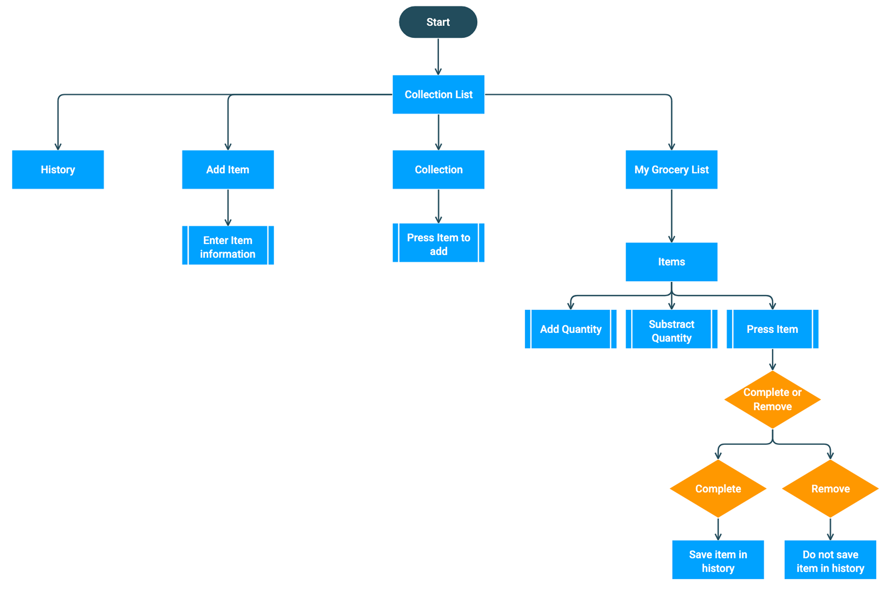

= Grocery List User Journey

== Objective

The objective of the user journey is to provide a diagram of how the user will navigate through the grocery list feature. This diagram includes the process and action the user will have on each screen. 

== User Journey

The user journey diagram shows the different scenarios the user can encounter when using the grocery list feature. The feature start on the collection list and from that page you can go to different screens to view the history, grocery list, and to add custom items. The user journey also shows the options that the user have when he interacts on the grocery list screen.