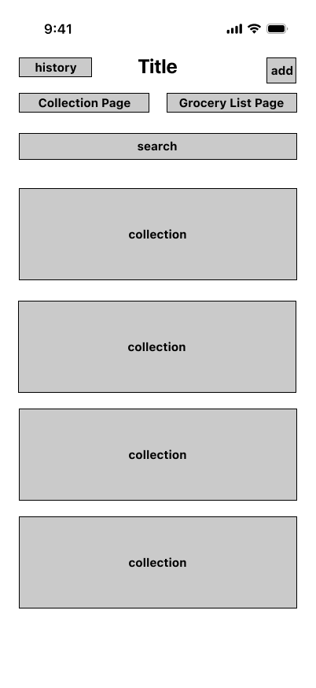
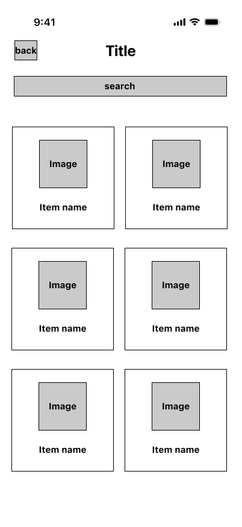
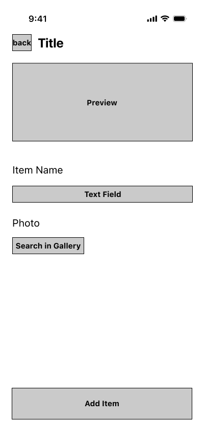
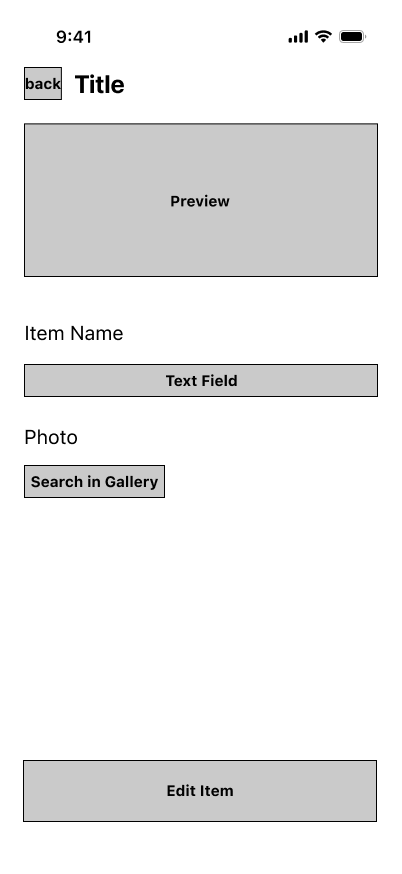
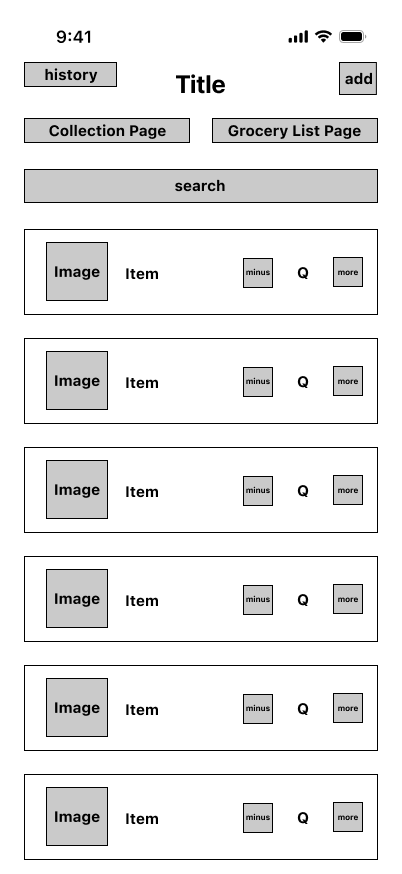
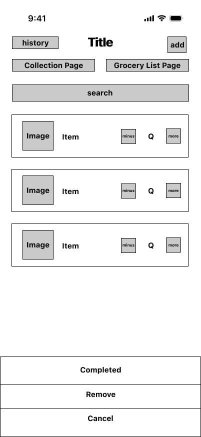
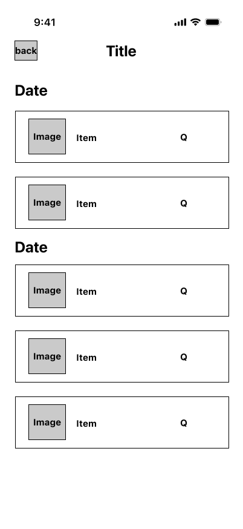
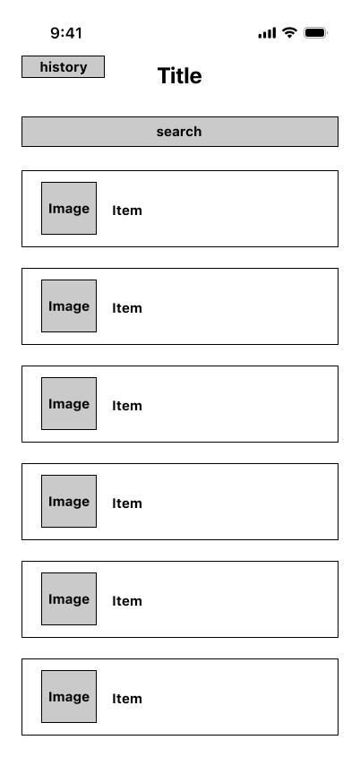

= Grocery List Wireframe

== Objective

The objective of the wireframe is to provide a visual representation of how the grocery list feature will look. On the wireframe isn't necessary to include the actual content or design, this will only include empty containers that indicate where the content will be placed.

== Wireframes

This wireframe represents the first page of the grocery feature. Here the user will be able to see the different collections of items that are available to add to their grocery list. If the user doesn't find the item they are looking for, they can add a new collection by clicking the + button.

This wireframe represents the page that will show the items under a collection. Here the user will be able to see the items that are available to add to their grocery list. These items will be displayed in a grid view as a button that will have the image and name of the product. Every time the user press the item will add one of that item into their grocery list. 

 

If under the collections the user doesn't find the item they are looking for, they can add a new item to the collection by clicking the + button. This will open this page were the user would see a preview of the item they are adding and a form to add the item to the custom collection. The user would also have the option to edit a custom item they already have in the custom collection. 

When the user wants to see the items they have added to their grocery list, they can click on the button called "My Grocery List". This will open this page where they can add more of the items they want to buy or remove items from their list.

If the user touch one item on their grocery list, this will open an action sheet that allows the user to select the item as complete or remove it from the list. If they select the complete option, the item will be removed from the list and saved on the history of the user. If the user selects the remove option, the item will be removed from the list and not saved on the history of the user.

Here the user will see the items that they have completed. This will display the day they select it's completed, the image and name of the item, and the quantity of the item that they have bought.

In the custom items collection the user would have the option to enter a page where they can see all the items they have created. Here they will have the option to edit the item or delete it.

== Conclusion

These wireframes provide a visual idea of how the grocery list feature will look. This will help the designer to have a clear idea of how the feature will look and how the user will interact with it.