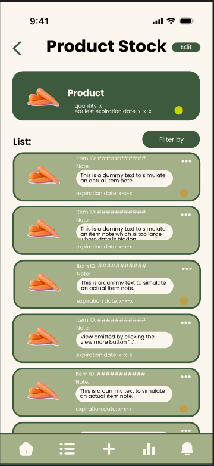
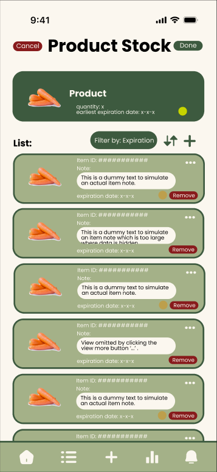
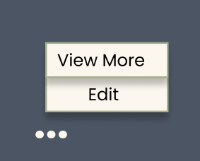
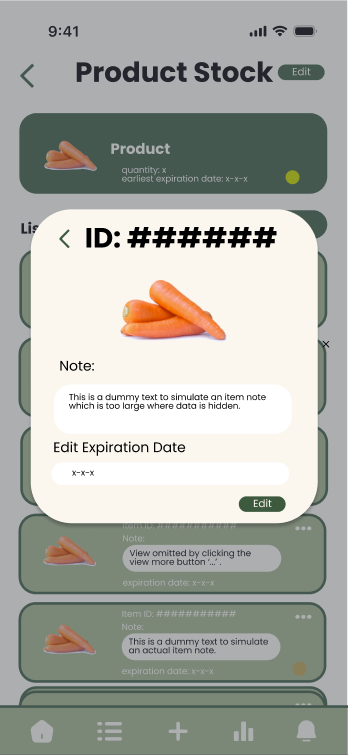
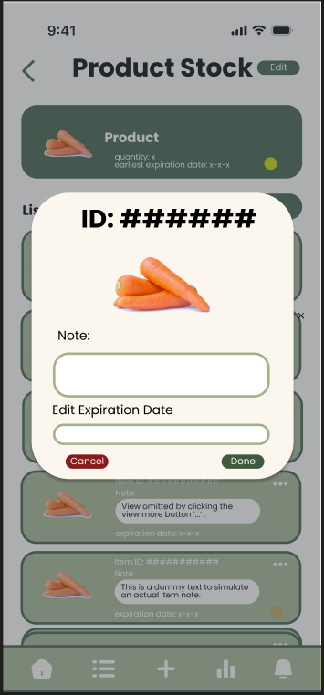
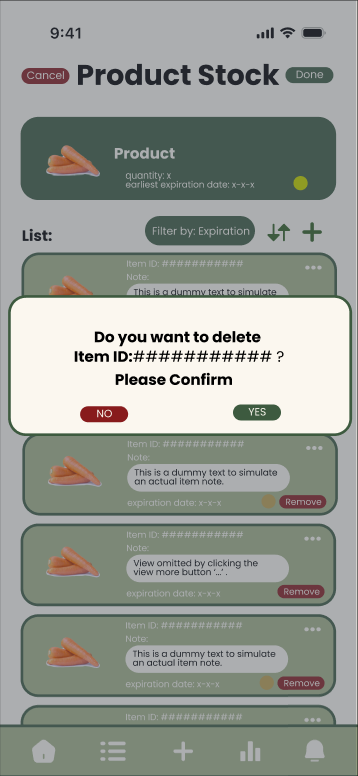
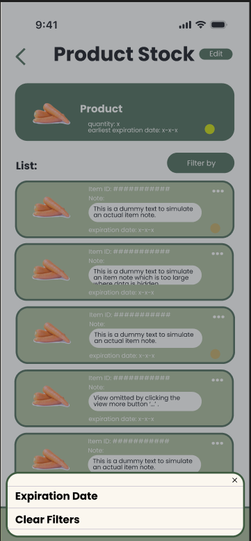
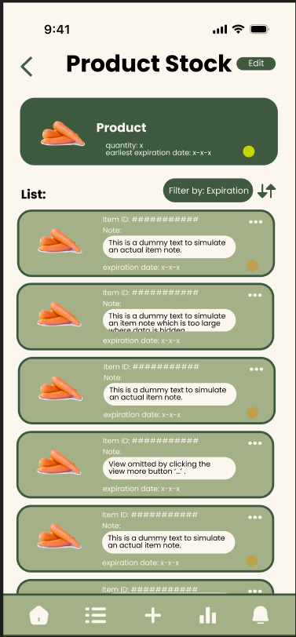

= Product Stock Mock Ups
Author: Jorge L. De León Orama
:toc:
:sectnums:

== Mockups
The Product Stock screen displays a header card summarizing the product and a scrollable list of individual stock entries below. Each stock entry card shows the item's ID, note, expiration date, and status indicator. A white bar is left at the bottom where the global navigation buttons from the dashboard screen should appear.

The designed mockups follow the predefined product stock sequence diagram, found within `doc/2-descriptive/domain-description/events/product-stock/`, to ensure all possible views are covered.

== Product Stock Screen Mockups
The Product Stock screen is the primary screen for this feature. Its tappable components include: the back arrow (top left), the Edit toggle button (top right), the Filter by dropdown (center right), the sort button (right of filter), the three-dots menu per list item, the Remove button per item (Edit mode only), and the add (+) button (Edit mode only).

== Button Explanations
The following describes each interactive element present in the Product Stock screen:

* Back Arrow (top left):
** Returns the user to the previous screen (e.g. the product listing or inventory overview).
* Edit Button (top right):
** Toggles the screen into Edit mode. In Edit mode, the header changes to show Cancel and Done buttons, a Remove button appears on each list item, and a + (add) button appears next to the filter controls to allow adding new stock entries.
* Filter by / Sort (top right area):
** The Filter by button opens a dropdown to sort or filter the stock list. The sort arrow next to it toggles between ascending and descending order. See the Filters section below for details.
* Three-Dots Menu (...) per item:
** Tapping the three-dots icon on any stock item card opens a small context menu with two options: View More and Edit. See the Three-Dots Menu section below.
* Remove Button (Edit mode only):
** Visible only when Edit mode is active. Tapping Remove on a stock entry opens a confirmation dialog before permanently deleting the entry. See the Remove Item Confirmation section below.
* Add Button (+) (Edit mode only):
** Visible only when Edit mode is active. Appears next to the Filter controls. Tapping it opens the Create Stock Entry form.

== Three-Dots Menu
Each stock item card features a three-dots (...) icon in the top-right corner of the card. Tapping this icon reveals a small popup menu with two options:

* View More – Opens a read-only modal showing the full details of the stock entry.
* Edit – Opens an editable modal pre-populated with the current details of the stock entry.

The user can tap anywhere outside the menu to dismiss it without taking any action.

== View More Modal
Tapping View More from the three-dots menu opens a modal overlay displaying the full details of the selected stock entry in read-only format. The modal includes:

* A back arrow in the top-left to close the modal and return to the stock list.
* The stock item ID as the modal title.
* A photo of the product.
* The item's Note field (read-only).
* The Edit Expiration Date label with the current expiration date value shown (read-only in this view).
* An Edit button at the bottom-right that transitions the modal into edit mode.

== Edit Modal
The Edit modal can be reached either by tapping Edit from the three-dots menu directly, or by tapping the Edit button within the View More modal. The Edit modal includes:

* The stock item ID as the modal title (not editable).
* A photo of the product.
* An editable Note text field.
* An editable Expiration Date field.
* A Cancel button (bottom-left) that dismisses the modal without saving changes.
* A Done button (bottom-right) that saves the changes and closes the modal.

== Remove Item Confirmation
When the user taps the Remove button on a stock entry while in Edit mode, a confirmation dialog appears before the item is deleted. The dialog contains:

* A message asking the user to confirm deletion, identifying the item by its ID.
* A NO button (left, red) that cancels the operation and dismisses the dialog.
* A YES button (right, green) that confirms and permanently removes the stock entry.

== Filters
The Filter by button located in the top-right area of the stock list opens a dropdown filter panel. In the base state, the button reads Filter by. Once a filter is actively applied, the button updates to display the current filter label (e.g. Filter by: Expiration).

The filter panel allows users to select a sorting or filtering criterion for the stock list. The available filter options are:

* Expiration Date – Sorts entries by expiration date.
* Clear Filters – Removes any active filter and returns the list to its default order.

The user can tap anywhere outside the filter panel to dismiss it without making a change. The sort arrow button next to the filter toggles the sort direction (ascending or descending) for the currently applied filter.

