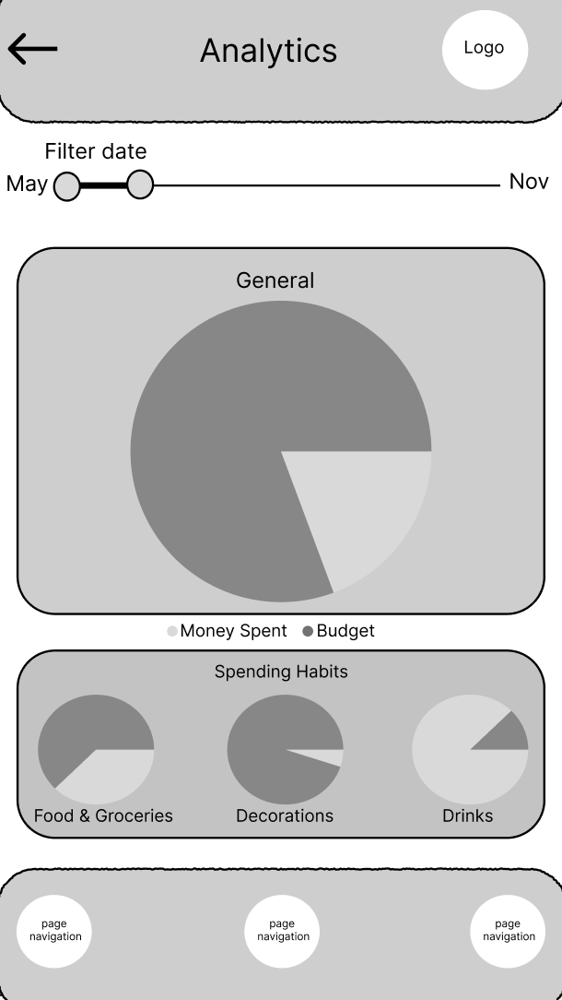

==Budget Spending Page Wireframe
Author: Nataliavera6

This page is necessary because it provides a visual representation of spending habits and budget. The purpose of this page is to allow users to track where their money is allocated throughout the month. 

-The logo of the app is placed at the top right of the page 
-The main data visual is placed at the center of the page. 
-Data visuals based on category ar placed below the main data visual.
-The option to filter date is placed at the top of the page

Final product::

