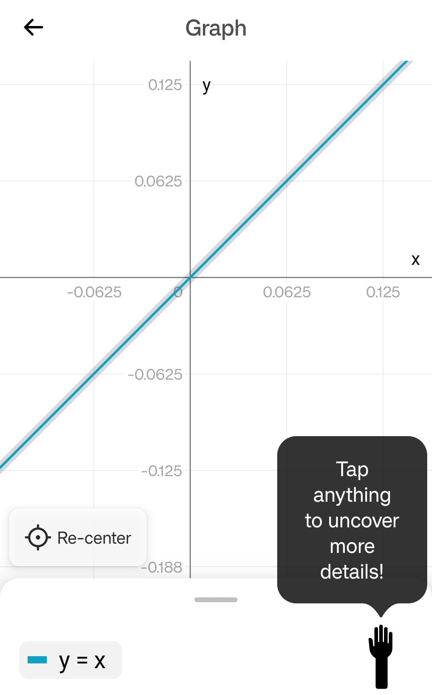
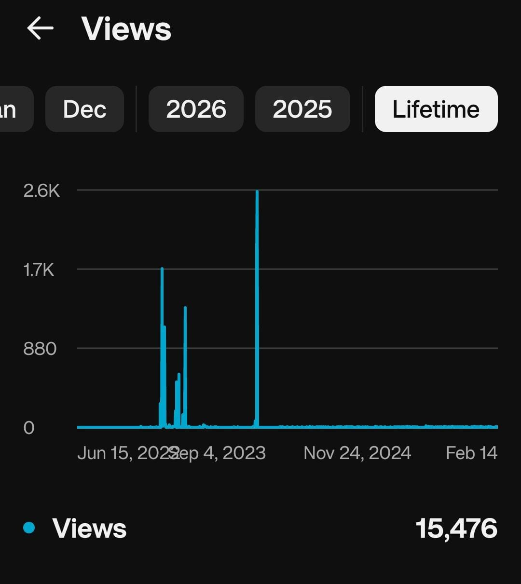
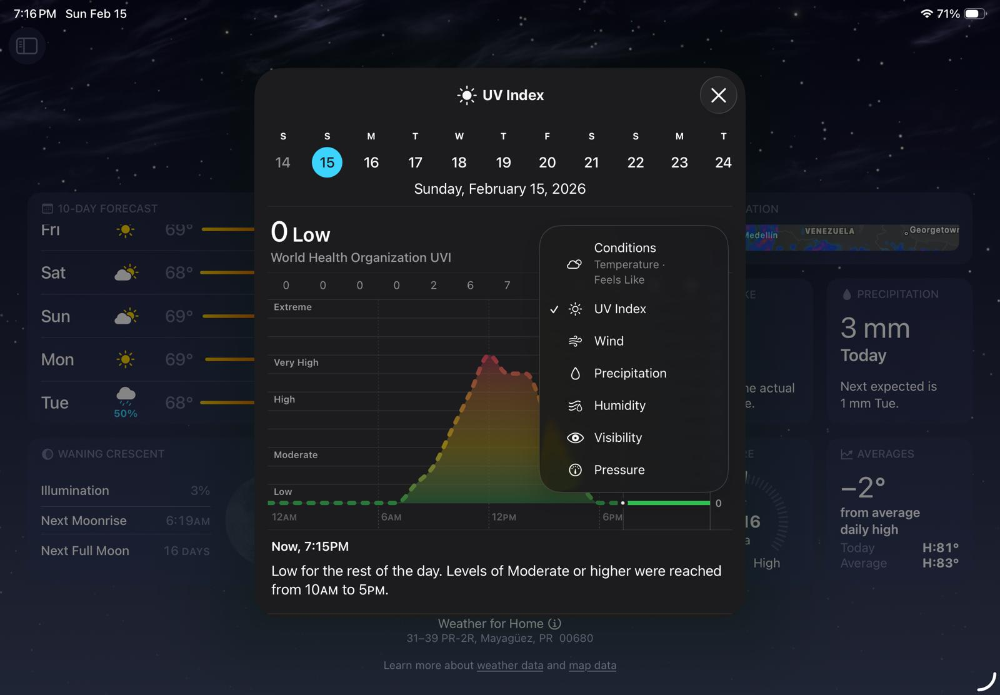

= Research: Mobile Report Screen Interaction Patterns
Author: Ian Rivera Troche 

== Objective

Gain an understanding of how different mobile apps allow users to interact with report screens (namely graphs), focusing on gestures, navigation, and filtering. Findings will inform design decisions for the project’s report screen interface.

---

== Apps Analyzed

* PhotoMath (Android)
* YouTube Studio (Android)
* Screen Time (Android, OxygenOS)
* Weather App (iOS, iPad)
* Battery Usage (Android, OxygenOS)

---

== Evaluation Criteria

Each app is analyzed based on:

* Gestures (zoom, scroll, tap, etc.)
* Filtering
* Navigation Between Reports
* General Usability Observations

---

== Comparative Interaction Table

[cols="1,2,2,2,2,2"]
|===
| App
| Gestures
| Filtering
| Navigation
| Pros
| Cons

| PhotoMath
| Tap, pinch-to-zoom, scroll or drag
| N/A
| Graphs are navigated by dragging one's finger across the screen
| Mostly intuitive and shows necessary information
| No tapping on the graph to get specific coordinates at the tapping location, though not really necessary

| YouTube Studio
| Tap
| Filter by amount of days to show in the graph
| There is no navigation in terms of scrolling or zooming in
| Provides daily metrics and can be filtered to see metrics spanning across a wide amount of days
| No pinch-to-zoom, scroll or drag gestures (perhaps not necessary here)

| Screen Time
| Tap, scroll to switch graph (week)
| Filter by week
| There is no navigation in terms of scrolling or zooming in
| Provides daily metrics and can be filtered to see particular weeks
| No pinch-to-zoom, scroll or drag gestures (perhaps not necessary here)

| Weather App
| Tap and drag (hold), scroll to switch graph (day)
| Filter by day or graph type
| Tap and drag to navigate across the different points of the graph, though no zooming in
| Provides various metrics and intuitive finger dragging to view specific datapoints
| No tap to show a datapoint and keep it on screen, have to hold

| Battery Usage
| Tap, tap and drag (no hold)
| No filtering, just shows the last 24 hours
| Can tap on the graph to show particular hour frame or tap and drag to show multiple hour frames (no need to hold one's finger on the screen)
| Provides relevant information concerning the battery percentage across the last 24 hours as well as the amount each app has consumed
| The graph is quite small and there is no gesture to zoom in and only the last 24 hours can be seen

|===

---

== Detailed Findings

=== PhotoMath

image::photomath1.jpeg[Graph in PhotoMath]
image::photomath2.jpeg[Graph after tapping]

image::photomath4.jpeg[Graph center is tapped]
image::photomath5.jpeg[Another graph]

==== Notes
* The graph can be navigated by dragging one's finger across the screen.
* If you scroll or drag beyond the center, you can tap the re-center button to come back to the center of the graph.
* Pinch-to-zoom is used to zoom in or zoom out of the graph.
* There doesn't seem to be any particular filtering.
* Tapping on the graph brings up more information on the graph.
* There is a hand icon that when tapped highlights the graph line. It says to tap anything to uncover more details.
* The graph y = x seems to only have one tappable spot, namely the center for the intersections. Another graph, namely y = x^2^ + x + 3, has two tappable spots. One is the intersection with the y-axis and the other the minimum of the graph. Essentially, certain points are tappable to see more precise information.

---

=== YouTube Studio

image::ytstudio0.jpeg[YT Studio Views]
image::ytstudio3.jpeg[YT Studio Watch]
image::ytstudioSUBS.jpeg[YT Studio Subs]
image::ytstudio1.jpeg[YT Studio Views 28D Tap Point]
image::ytstudio2.jpeg[YT Studio Filtering By Days]

image::ytstudioOTHERS.jpeg[YT Studio Lifetime Filtering]

==== Notes
* YouTube Studio contains an analytics section where it allows the user to view three metrics related to their channel: view count, watch time in hours, and subscriber count. 
* User can scroll to select which one is shown.
* The metrics are shown as graphs that highlight increase or decrease in amount over time.
* Tapping on any point of the view count graph shows the specific date with the specific amount of views.
* The graph can be filtered to show any amount of days from 7 days all the way to lifetime.
* Watch hour and subscriber graphs function the same.
* There are no pinch-to-zoom, scroll, or drag gestures on the graphs themselves. User scrolls to select from the available day count amounts to select how many days the graph will show.
* There are other metrics beyond these. For instance, there is a percentage bar that shows how users find one's channel and the typical amount of views shown simply as a text range.

---

=== Screen Time (OxygenOS)

image::screentime1.jpeg[Screentime]
image::screentime2.jpeg[Screentime 2]

==== Notes
* Shows the amount of screentime in hours or minutes per app.
* Tap on the bars, representing the days, to see how much total screentime was expended on a particular day.
* Arrows allow switching between graphs, each graph being representative of each week.
* There is no scrolling, dragging, or pinch-to-zoom. 

---

=== Weather App (iOS, iPad)

image::weather0.jpeg[Weather Home]

image::weather2.jpeg[Weather 2]

==== Notes
* The Weather app on iOS provides a wide amount of metrics related to the weather.
* Graphs for wind, day condition forecasts, UV index, precipitation, pressure, visibility, and humidity all function the same. 
* A button on the right can be tapped to switch between these different graphs, and days can be filtered at the top. Dragging across the graph also switches to either the earlier or next day. 
* User can tap, hold, and drag finger across the screen to see a line that intersects the graph at a particular point and shows the specific datapoint there. This is a feature in all graphs, including the sunlight one.
* There is no scrolling or pinch-to-zoom.

---

=== Battery Usage (OxygenOS)

image::battery1.jpeg[Battery Usage 1]
image::battery2.jpeg[Batter Usage 2]

==== Notes
* Provides charge percentage in the last 24 hours.
* Shows the percentage of battery that each app has consumed.
* Can tap on the graph to see a specific time interval as well as tap and drag (without needing to hold) to see multiple intervals together.
* Different colors, green and orange, possibly indicating high or low consumptions.
* There is no scrolling or pinch-to-zoom.

---

== Cross-App Patterns & Insights

=== Common Gesture Patterns

Several consistent interaction patterns can be seen across the analyzed apps:

* **Tap as the primary interaction mechanism**  
  Every app relies on tapping as the fundamental method for revealing details or selecting data.

* **Drag for exploration of data**  
  Apps displaying continuous data (like PhotoMath, Weather, Battery Usage) allow users to drag across graphs to inspect values dynamically.

* **Pinch-to-zoom is rare in report graphs**  
  Most analytic report apps appear to avoid zoom gestures in their graphs, likely due to fixed time scales or simplified data views. Only PhotoMath supports pinch-to-zoom, perhaps due to its purpose being to show mathematical graphs rather than data reports. 

* **Graphs often prioritize readability over manipulability**  
  Many graphs are intentionally static, favoring clarity and simplicity rather than deep interaction.

---

=== Filtering Patterns

Several consistent filtering patterns can be gleaned across the analyzed apps:

* **Time-based filtering dominates**  
  Most apps filter by day, week, or a range of days.

* **Filtering is usually explicit and UI-driven**  
  Filters are controlled through buttons, selectors, or tabs instead of gestures.

* **Minimal filtering complexity**  
  None of the analyzed apps introduce advanced multi-parameter filtering directly within graph views. The filtering is kept relatively simple, tied to what's most important.

---

=== Navigation Patterns

Navigation between report views follows predictable models:

* **Discrete views instead of continuous navigation**  
  Users switch between predefined graphs rather than freely navigating a large data space.

* **Tabs and buttons over gestures when selecting graphs**  
  Switching graphs primarily occurs through visible UI controls (YouTube Studio, Weather app, Screen Time), though some like the Weather app accept swiping to switch graph.

* **Limited graph-level navigation**  
  Scrolling or zooming in on the graph itself is uncommon outside of specialized apps like PhotoMath.

---

=== General Usability Observations

* Simpler interaction models reduce cognitive load.
* Static graphs are common when precise manipulation is unnecessary, the goal being to show data to the user.
* Drag interactions are favored when users need to inspect continuous data.

== Recommendations for Project

Based on the observed interaction patterns:

* **Tap should remain the core interaction mechanism**  
  Tapping is universally understood and expected for revealing datapoint details.

* **Drag interactions are valuable for continuous datasets**  
  If the project’s graphs are to represent continuous data (such as time series or trends), tap-and-drag inspection is intuitive and widely used.

* **Pinch-to-zoom should be considered carefully**  
  Most mobile report apps omit zooming. It should only be included if users truly benefit from scale manipulation.

* **Prioritize clarity over excessive interactivity**  
  Many successful apps deliberately restrict gestures to avoid overwhelming users. Gestures should be intuitive.

* **Time-based filtering is a safe default**  
  Filtering by day/week/range aligns with common patterns and user expectations.

* **Filtering should rely on explicit UI controls**  
  Buttons or tabs provide better discoverability than hidden gestures.

* **Avoid unnecessary gesture complexity**  
  Interactions should feel predictable and consistent with familiar mobile analytic report apps.