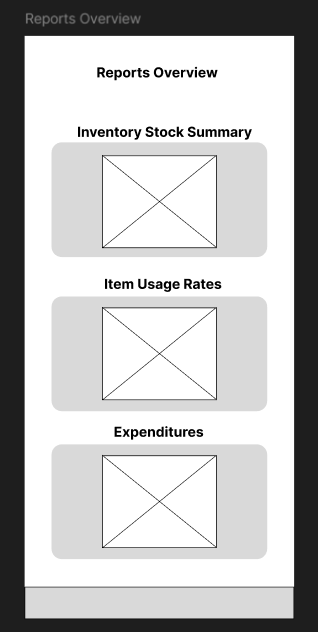
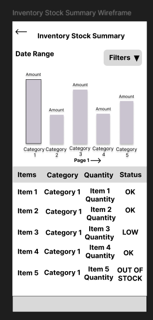
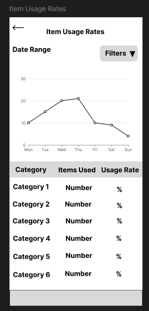
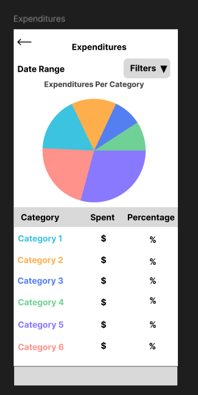
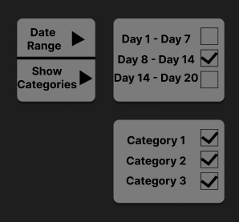

= Report Screen Wireframes
:author: @Programian, AI was used to help with proofreading the text
:toc:
:toclevels: 2

== Introduction

The purpose of this document is to present the wireframes made in Figma for the project's report screens. One of the specifications of the project's A3 is: "Generate reports of inventory in your home, expenditures and usage rates for each item so you can plan your next shopping trip accordingly." [1]

Images of the wireframes are presented as well as a description of the thought process behind each of them to understand how their implementation would work. While not necessarily free from further refinement, these wireframes establish a consistent interaction model and filtering system.

== Wireframes

The Reports Overview screen features three report cards that users can tap to open up a more detailed screen for a specific kind of report. The box with an X is a placeholder for a graphic representation, namely an image or widget.

In the Inventory Stock Summary screen, a bar graph is given that represents the total number of items available in stock for a category. Tapping a bar will show the specific items of that category and their amounts in the table as well as their status (OK, LOW, OUT OF STOCK). OK indicates that the current inventory of said item is fine. LOW indicates the item is running out, potentially consider buying more. User should have a way to define what the threshold is for which items, but that goes beyond the scope of the current document. OUT OF STOCK means the item has run out completely. Users can navigate through pages to view other categories using the arrows next to the Page # text.

The Item Usage Rates screen shows a line graph that's indicative of the number of items being used per day. The table shows the amount of items per category being consumed and their rate of usage.

The Expenditures screen shows a pie graph indicating how much is being spent on each respective category, each colored segment on the graph aligning with a category. This helps gain an idea as to which kinds of items are putting stress on the budget, how much is being spent, and the percentage of expenditures on each category.

The filters can be selected by tapping the Filters button with the black triangle. Doing so brings up the option to set the date range to show on the graph (mutually exclusive selection) or to select or deselect categories to be shown (multiple can be selected or deselected at once).

== References

[1] Sorrentini, L. (2024). Digital Home Inventory A3. INSO 4115 Project Document.