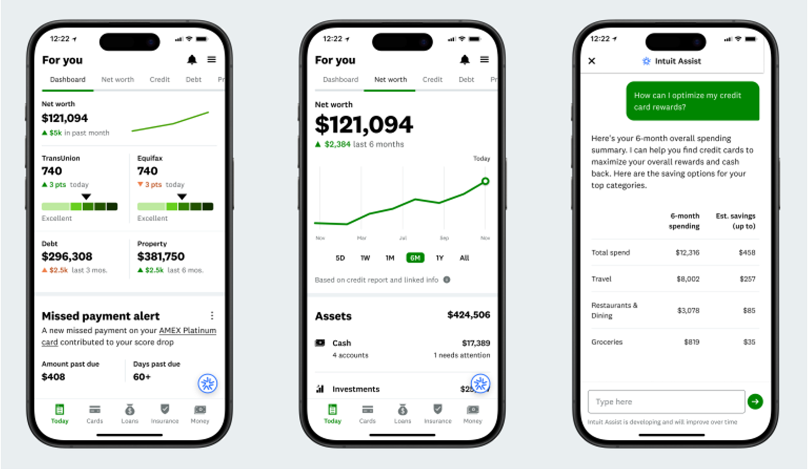
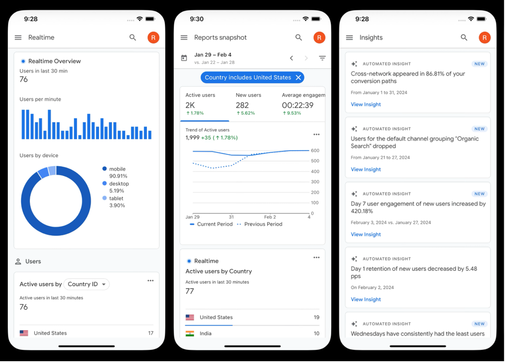

= Mobile Data Visualization Best Practices

Dasboards in mobile applications must present complex and often real-time information within limited screen space. Because mobile screens restrict width and interaction precision, layout decisions directly affect readability, hierarchy, and usability.

The purpose of this research is to analyze how popular mobile applications organize complex data on small screens and identify visualization and layout best practices that can guide the design of the Reports & Insights feature.

== Applications Analyzed
=== 1. Credit Karma
A financial dashboard focused on personal metrics and alerts.

* High priority KPI ("Net Worth") placed at the very top.
* Line charts used for trend visualization over time.
* Information segmented into stacked cards (Assets, Debt, Alerts).

*Key Takeaway:*
Strong vertical hierarchy with large KPIs first, followed by modular cards for secondary information.

=== 2. Google Analytics (Mobile)
A data-heavy analytics dashboard optimized for condensed presentation.

* Scroll-based layout instead of multi-column grids.
* Metrics grouped in compact summary cards (Active users, New users, Engagement).
* Use of simplified charts (bar, line, donut) adapted to mobile width.

*Key Takeaway:*
Complex datasets are simplified through compact metric summaries and scrollable, single-column stacking.

=== 3. Apple Fitness
An activity and goal tracking dashboard.

image:images/apple-fitness.png[]

* Visual first KPIs (Activity Rings) for instant recognition.
* Bottom tab navigation for primary categories.
* Combination of charts and numeric values within cards.

*Key Takeaway:*
Use of strong visual anchors (rings, icons) to communicate status quickly, supported by modular cards.

== Cross-App Observations
Across all three applications, several consistent patterns emerge:

1. *Single-column vertical stacking* +
Multi-column desktop grids collapse into scrollable stacked sections.

2. *Top priority metric placement* +
The most important KPI is always displayed at the top with larger typography.

3. *Card-based segmentation* +
Data is divided into distinct cards to reduce cognitive load.

4. *Simple chart types* +
Line charts, bar charts, and donut charts are preferred over complex visualizations.

5. *Persistent bottom navigation* +
Core sections are accessible through a fixed bottom tab bar.

== Best-Practice Recommendations
Based on the analysis, the following standards are recommended: +

* Place the primary KPI or summary metric at the top of the screen.
* Use vertically stacked cards to separate different report sections.
* Prefer simple, mobile-friendly charts (line, bar, donut).
* Limit visible metrics per section to reduce clutter.
* Use strong typography contrast to emphasize key numbers.
* Maintain persistent bottom navigation for section switching.
