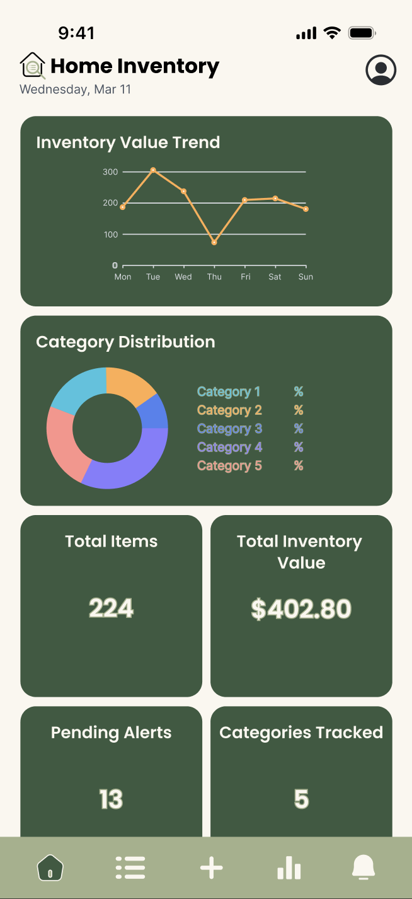
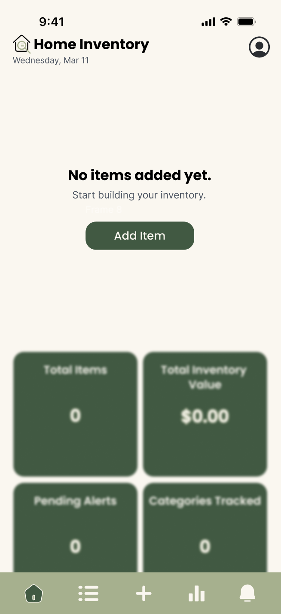

= Home/Dashboard Mockup Designs

== Introduction
This document presents the finalized UI mockup designs for the *Home/Dashboard* screen of the Home Inventory app.  
The mockups were created in Figma based on the previously defined wireframes and interaction flow. These designs serve as the visual reference for the upcoming UI implementation phase.

== Default Dashboard State
The default dashboard view displays a summarized overview of the user's inventory data.  
It includes visual analytics components and quick-access summary cards to support user awareness and decision-making.

* Inventory value trend chart.
* Category distribution visualization.
* Summary statistic cards (Total Items, Inventory Value, Pending Alerts, Categories Tracked).
* Bottom navigation bar for primary application sections.

== Empty Dashboard State
The empty state is shown when the user has not yet added any inventory items.  
This state guides the user to begin interacting with the system through a clear call-to-action.

* Informational empty-state message.
* Primary action button to add a new item.
* Placeholder summary cards showing zero values.
* Consistent navigation structure.

== Design Consistency
The mockups maintain consistency with the defined design system as they apply the following UI elements:

* Standard color palette and typography.
* Unified navigation patterns.
* Reusable card-based layout structure.
* Consistent spacing and alignment.