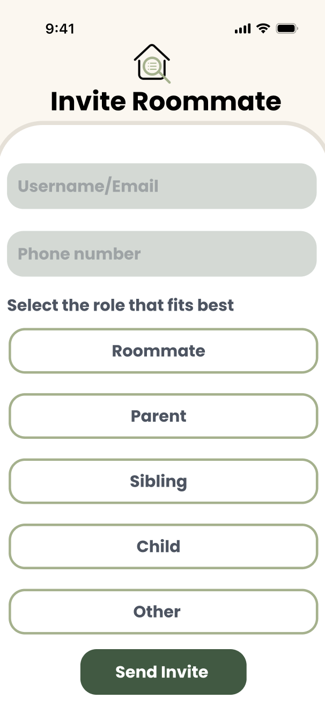
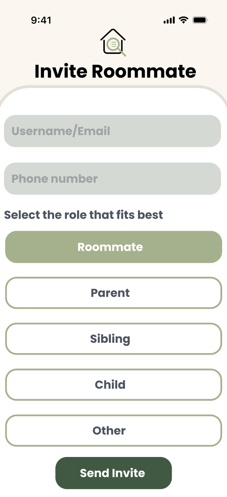
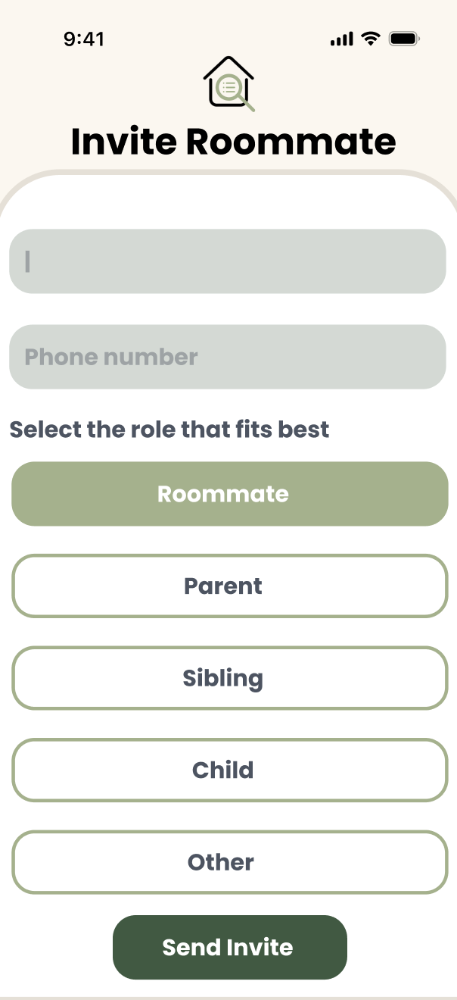
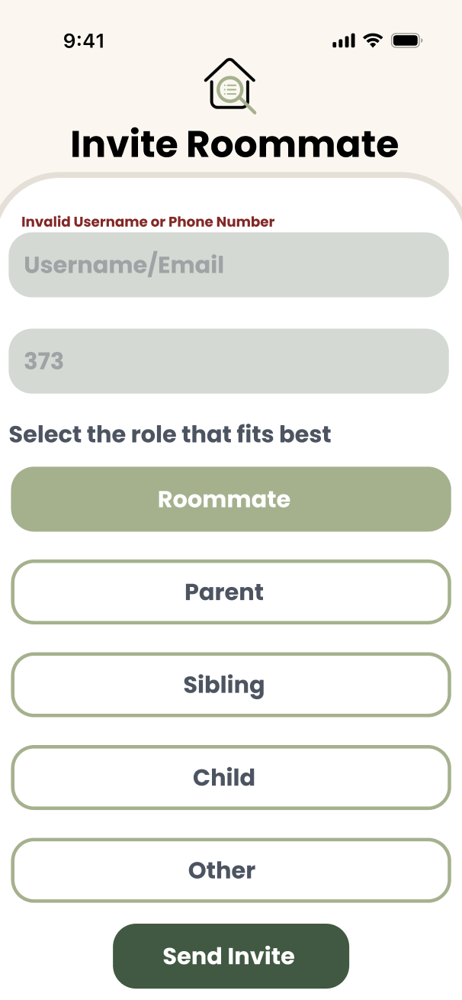

= Create Invite Roommate Screen UI

Author: @nataliavera6
// Issue: #354

== Purpose:
Design the user interface for the "Invite Roommate" screen, ensuring it is intuitive, visually appealing, and consistent with the overall design language of the application. The screen should allow users to easily invite their roommates to join the shared inventory and manage their invitations effectively.

== Final product:
Final designs can be viewed in the `docs/design-team/Invite-Roomate-Screen-UI/images` folder.

[%unbreakable]
--
*Design description:*

- The "Invite Roommate" screen will feature a clean and modern design, with a focus on usability and accessibility.
- All elements were designed following the defined branding and typography guidelines.
- Users will enter the invited user's email address, phone number and household role in the input field provided.
- Once all of the solicited information is entered, the user can select the"Send Invitation" button, allowing users to send the invitation to their roommate.

.Invite Roommates Design.

.Invite Roommate Screen Design With Selected Roommate Role.

.Invite Roommate Screen Design With Selected Input Field.

.Invite Roommate Screen Design With Invalid Input Field.

--
 