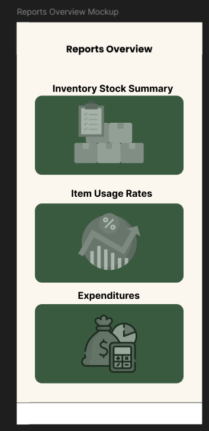
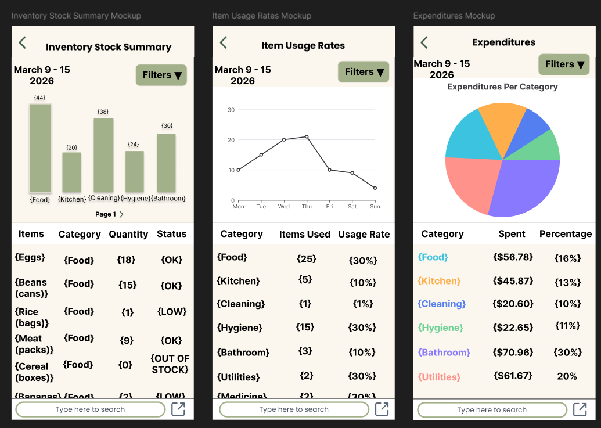
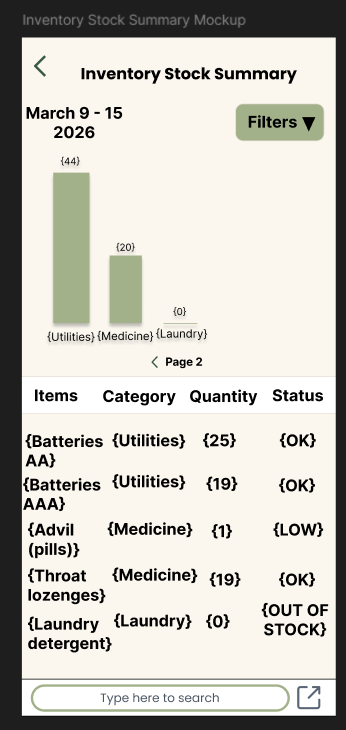
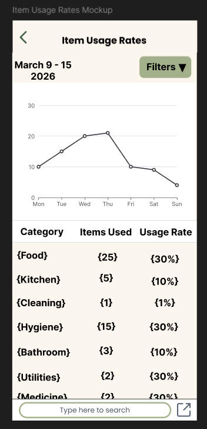
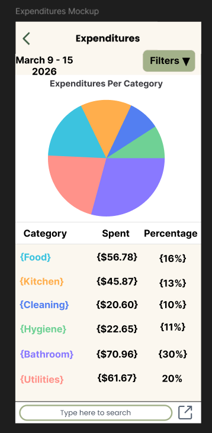
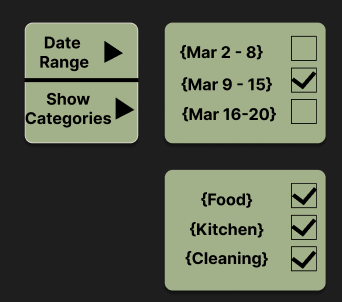
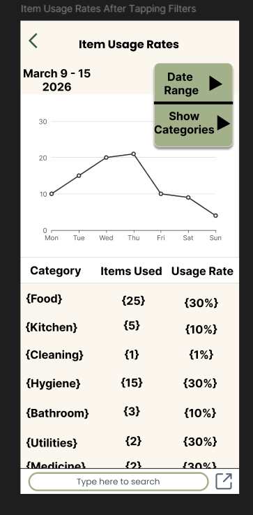
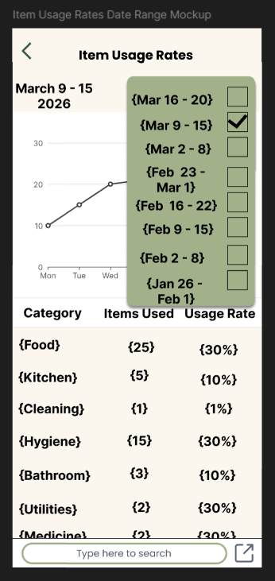
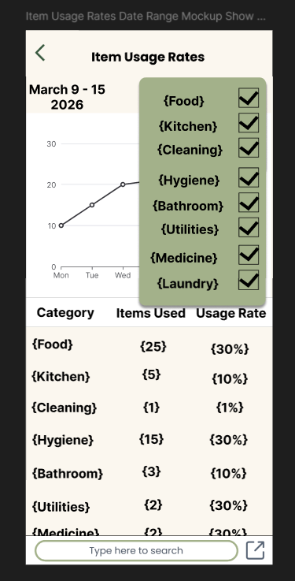
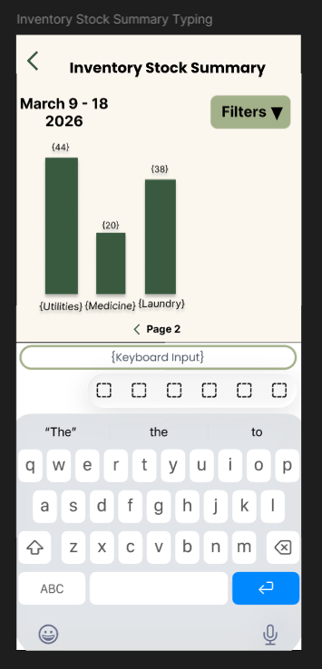

= Report Screen Wireframes
:author: @Programian
:toc:
:toclevels: 3

== Introduction

This document presents the mockups for the various Report Screen Mockups developed in Figma to guide their implementation.

== Mockups

=== Reports Overview

The Reports Overview screen features report cards that users can tap to go to one of three detailed report screens. A white bar is left at the bottom where the buttons from the dashboard screen should appear.

=== Report Screen Mockups

The three detailed report screens are Inventory Stock Summary, Item Usage Rates, and Expenditures. The tappable components in each of the screens are: the back arrow (top left), the Filters button (top right), the page arrow (middle of the Inventory Stock Summary page only), the graph bars (Inventory Stock Summary page only), the search bar (bottom middle), and the export button (bottom right).

==== Button Explanations

- The back arrow on the top left in each screen will take the user back to the Reports Overview screen.
- The Filter button opens up filters (explained down below in the Filters section).
- The page arrow and graph bars are explained below in the Inventory Stock Summary section.
- The search bar is used to search for keywords or items on the table (keyboard open screen shown down below).
- The export button can be used to generate an exportable version of the report.

==== Note concerning the {data}

Note that all text in {} is sample text, the real data should be pulled from backend. Text not in {} should be implemented as shown. Each of the tables should be scrollable to find more data. Graphs shown here are merely examples, the real implementation will require graph generation with dynamic real data pulled from backend.

=== Inventory Stock Summary

image::images/Inventory Stock Summary page 1.png[]

In the Inventory Stock Summary screen, a bar graph is given that represents the total number of items available in stock for a category. Tapping a bar will show the specific items of that category and their amounts in the table as well as their status (OK, LOW, OUT OF STOCK). OK indicates that the current inventory of said item is fine. LOW indicates the item is running out, potentially consider buying more. User should perhaps have a way to define what the threshold is for which items, but that goes beyond the scope of the current document. OUT OF STOCK means the item has run out completely.

- The page arrow in the middle below the graph switches pages (if there are more categories that cannot be shown on the graph in the first page, then they are shown in the second page or subsequent pages if necessary).
- The graph bars can be tapped to only show items of that category on the table.

=== Item Usage Rates

The Item Usage Rates screen shows a line graph that's indicative of the number of items being used per day. The table shows the amount of items per category being consumed and their rate of usage.

=== Expenditures

The Expenditures screen shows a pie graph indicating how much is being spent on each respective category, each colored segment on the graph aligning with a category. This helps gain an idea as to which kinds of items are putting stress on the budget, how much is being spent, and the percentage of expenditures on each category.

=== Filters

The filters can be selected by tapping the Filters button with the black triangle (shown earlier in the images of each page). Doing so brings up the option to set the date range to show on the graph (mutually exclusive selection) or to select or deselect categories to be shown (multiple can be selected or deselected at once). The user can tap anywhere on the screen to exit out of selecting filters. What this looks like is shown below in the Item Usage Rates screen as an example, though it should work exactly the same in the other pages.

The user should be able to scroll within the respective green filter list boxes for both Date Range and Category selection to find more date ranges or categories to select if applicable.

=== Keyboard Open Input (Search Bar)

This is what it would look like when the user taps the search bar. Press enter on the keyboard to make the search. Tap outside the keyboard to pull it down and go back.