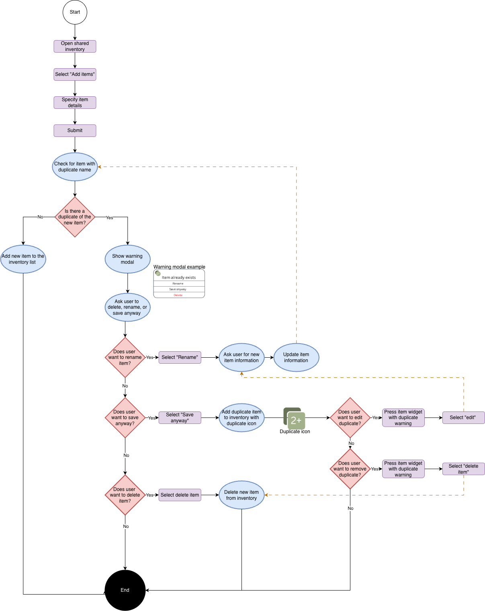

= Design User Flow Shared Inventory & Duplicate Warning
:toc:
:toclevels: 2

author:@nataliavera6

== Objective
Create a user flow for Shared Inventory interaction using the existing duplicate detection wireframes, ensuring the flow clearly represents how users interact with shared inventory and how the system handles duplicate item detection.

== Legend
- White circles represent the start of a process.
- Black circles represent the end of a process.
- Blue ovals represent a process or action that needs to be taken by the application.
- Purple rectangles represent a step that needs to be taken by the user.
- Red diamonds represent a decision point.
- Arrows indicate the flow of the process from one step to the next.
    1. Black arrows represent the normal linear flow of the process.
    2. Orange dashed lines represent an alternative flow or a flow that occurs when a certain condition is met.

== Share Inventory Duplicate Items Flowchart

== Primary Flow

=== 1. Shared Inventory Screen flow

1. User opens application.
2. User accesses shared inventory screen.
3. User adds new item to shared inventory.

=== 2. Create New Item in Shared Inventory
1. User specifies item details in the form.
2. User submits form.
3. System checks for duplicate items in shared inventory.
4. System displays a duplicate item warning if a duplicate is detected.

=== 3. Resolve Duplicate Item Warning
1. User can choose to either:
    a. Edit item details to resolve the duplicate issue.
    b. Proceed with adding the item to shared inventory despite the duplicate warning.
    c. Cancel the item addition process and return to the shared inventory screen. 
2. If user chooses to proceed with adding the item, the system adds the item to shared inventory and updates the inventory list.
    a. System displays added item with duplicate warning icon next to it in the inventory list to indicate that it is a duplicate item.
    b. User is taken back to the shared inventory screen where they can see the newly added item in the inventory list.
    c. System allows user to edit item details later to resolve the duplicate issue if they choose to do so.

3. if user chooses to edit item details, they are taken back to the item details form, where they can modify the item information to resolve the duplicate issue. After editing, they can resubmit the form, and the system will check for duplicates again.
4. If user chooses to cancel the item addition process, they are taken back to the shared inventory screen without adding the item, and the inventory list remains unchanged.