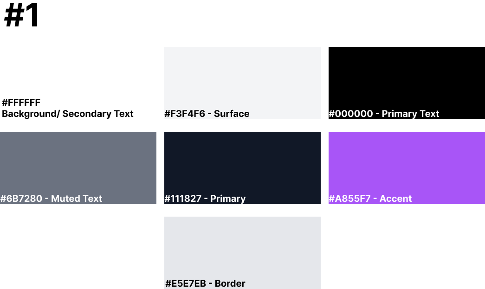
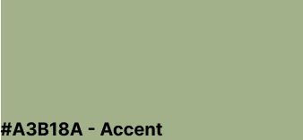
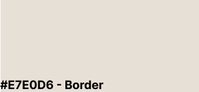

= UI Style Guide- Color Palette

The color palette is created with the goal of making the application consistent and pleasing to the user's eye. This color palette ensures that all components have appropriate contrast and look harmonious. Figma was used to determine the color palette, and four different ideas were developed, as follows:

* Idea #1

* Idea #2
image:images/idea_2.png[Idea 2]
* Idea #3
image:images/idea_3.png[Idea 3]
* Idea #4
image:images/idea_4.png[Idea 4]

The link for the color palette in Figma is the next one:
https://www.figma.com/design/BvG1sM9FdqC0Nlyvhpsyap/Home-Inventory?node-id=3-116&t=Efooz33jmEadresu-1

== Official Color Palette
=== Color Naming and Usage Rules 
The selected color palette is the idea #4. The color palette will work in the next way:

* **Background - #FBF7EF** - This color will be used for the application background.

image:images/background.png[Background]

* **Surface/Secondary Text - #FFFFFF** - This color is used for the surface (referring to cards, sections, and all creations of that style) and for secondary text to ensure that there is no poor contrast when used with dark colors.

image:images/surface.png[Surface]

* **Primary Text - #000000** - It is used as the main text color for the application.

* **Muted text - #4B5563** - It is known as “muted text” and can be used when presenting background text or in situations where we need to distinguish between selected and unselected text. 

image:images/muted_text.png[Muted Text]

* **Primary Color - #3A5A40** - This is the primary color. It should be used as the primary color for everything related to containers, buttons, and all related creations.

image:images/primary.png[Primary Color]

* **Accent - #A3B18A** - Accent is a supporting color used to highlight key elements of the interface and direct the user's attention. It is applied to primary actions (such as buttons), important states (badges/alerts), and active selections (tabs or filters). When used sparingly, it keeps the application clean and improves visual clarity and navigation.

* **Border - #E7E0D6** - This color is used as decoration for the containers and buttons on the borders.

== Usage Example

image:images/example.png[Usage Example]

