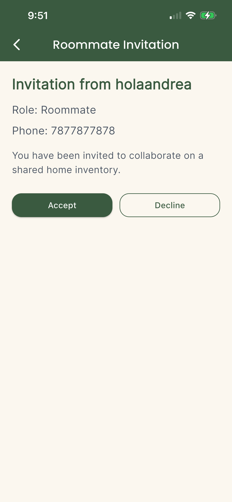
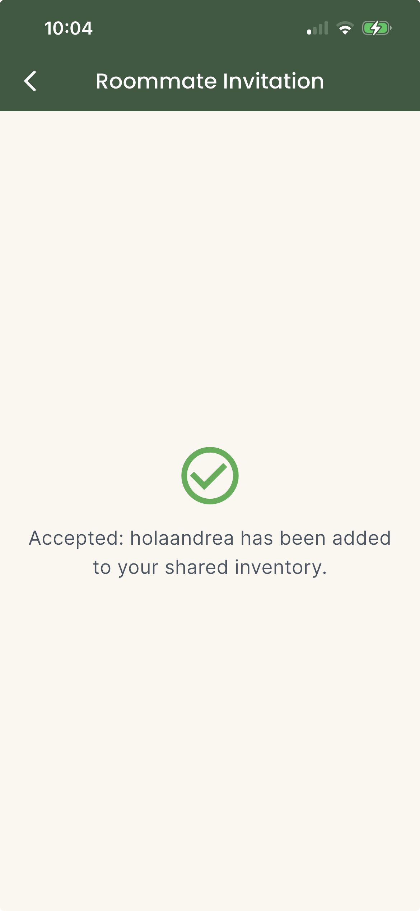
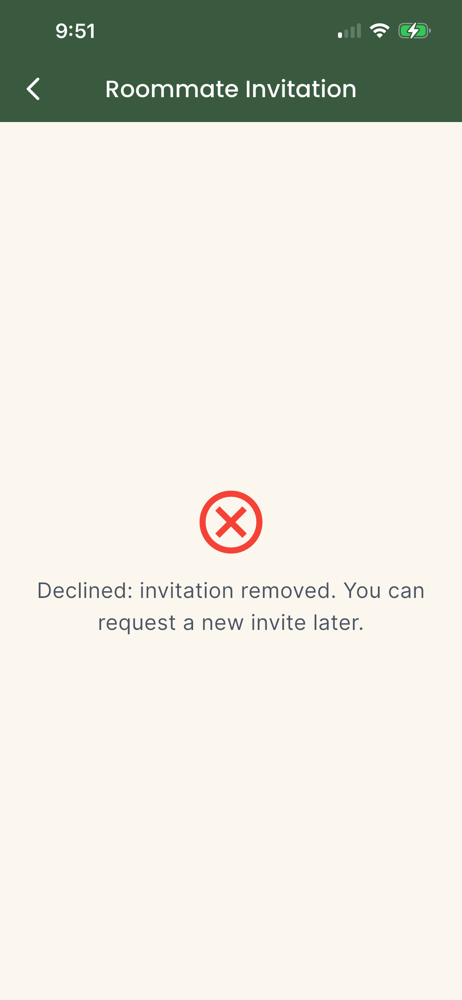
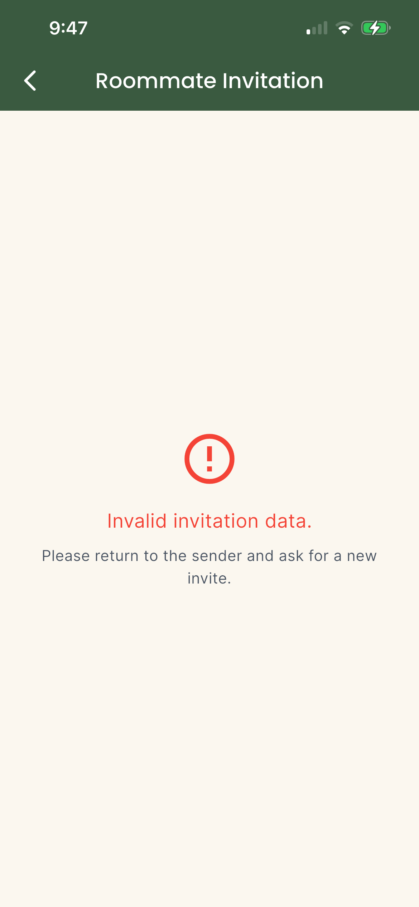

= Design & Implement Invitation Response UI

Author: @nataliavera6
// Issue: 356

== Purpose:
Design and implement the user interface for the roommate invitation response screen, allowing invited users to clearly review, accept, or decline an invitation. The screen should communicate the result of the user’s decision clearly while remaining consistent with the overall design language and shared household flow of the application.

== Final product:
Final designs and implementation files can be viewed in the `docs/design-team/View-roommate-invitation-screen/images` folder.

[%unbreakable]
--
*Design and implementation description:*

- The invitation response screen was designed and implemented to provide invited users with a clear and intuitive interface for reviewing a roommate invitation.
- The screen presents relevant invitation details, including who sent the invitation, the role you've been assigned, and the household it belongs to, when applicable.
- Users are provided with clear actions to either accept or decline the invitation.
- Feedback states were included to communicate the outcome of the user’s action, including accepted, declined, and failed response states.
- Edge cases such as expired invitations, previously answered invitations, and failed submissions were considered and reflected in the interface.
- All components were created to fit naturally within the shared household flow and to remain visually consistent with the rest of the application.

.Invitation Response Screen Design.

.Invitation Response Accepted State.

.Invitation Response Declined State.

.Invitation Response Error or Expired State.

--
