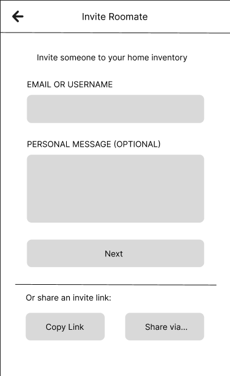
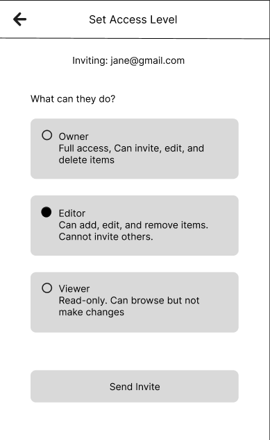
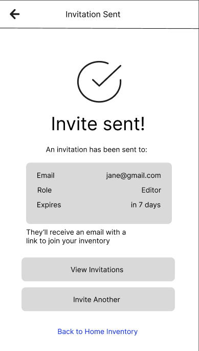
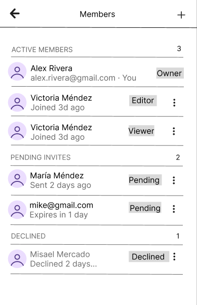
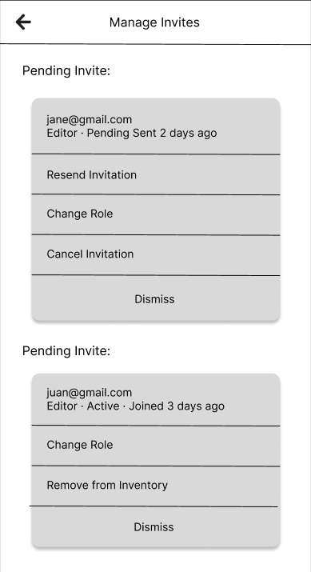

= Invite Roommate — Wireframes
:author: @daniellameleroo
:toc:
:toclevels: 2

== Overview

This feature lets users invite roommates to access a shared home inventory.
The flow covers sending an invite, setting a role, and managing invitations.

== User Flow

....
[Inventory Home]
      |
      v
[Manage Members] --> [Invite Roommate] --> [Set Role] --> [Send]
                                                             |
                                          [Success Screen] <-+-> [Error]
                                                 |
                                         [Invitations List]
                                                 |
                                    [Resend / Change Role / Cancel]
....

== Screens

=== Screen 1 — Enter Email

The user types an email or username to invite someone.

*Notes:*

- "Next" stays disabled until a valid email or username is entered.
- Invite links expire after 7 days.

---

=== Screen 2 — Set Access Role

The user picks what the invitee can do inside the inventory.

*Notes:*

- Editor is pre-selected by default.
- Choosing Owner shows a confirmation dialog before sending.

---

=== Screen 3 — Success

Confirms the invite was sent and offers next steps.

*Notes:*

- "View Invitations" goes to Screen 4.
- "Invite Another" resets back to Screen 1.

---

=== Screen 4 — Invitations List

Shows all members and pending invites in one place.

*Notes:*

- [...] opens the action menu (Screen 5).
- Warning appears when an invite expires within 1 day.
- Declined entries clear automatically after 7 days.

---

=== Screen 5 — Actions Menu

Appears when the user taps [...] on any invite or member.

*Notes:*

- Cancel and Remove actions both require a confirmation step.
- Resend resets the expiry clock to 7 days.
- For active members, "Resend" is replaced with "Remove from Inventory."

== Edge Cases

[cols="1,2", options="header"]
|===
| Situation | What happens

| Email not registered
| Prompt to send a sign-up invite instead.

| Already a member
| Block with an inline error message.

| Invite already pending
| Show existing invite with option to resend or change role.

| Link expired
| Invitee sees a message to request a new invite.

| Last owner tries to leave
| Blocked — must transfer ownership first.
|===