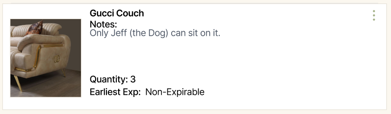
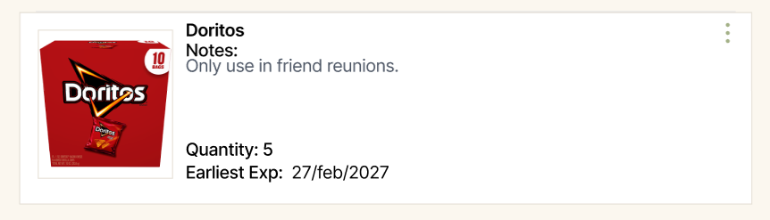
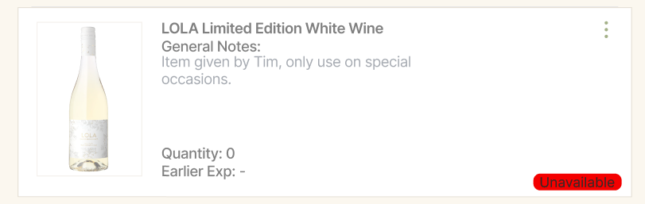
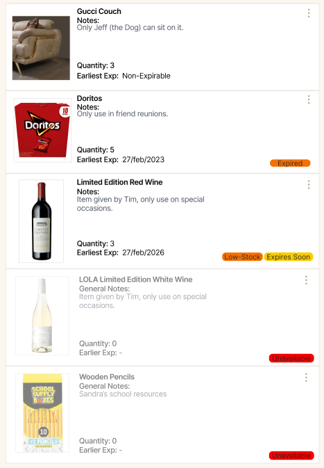

= Item Dispaly Wireframe
Author: Jorge L. De León Orama

== Overview
This document visually demonstrates the seperate item display wireframes, and its card stacking method. The Item display wireframe's contents are: 

* Name
* General Notes
* Quantity 
* Expiration Date
* View More Icon (top right)

== Wireframes 
The wireframe for a seperate *Non-Expirable* item is the following: 

The wireframe for a seperate *Expirable* item is the following, this takes to acount the earliest expiration date in a list of an item with different quanitites:

The wireframe for unavailable (out-of-stock) item:

The wireframe for item stacking, accompanied with visible status indicators:

== Concerns
The item image size consistency is very low, hence the search for a method in which image sizes remain consistent throughout different image size submsission is highly demanded.