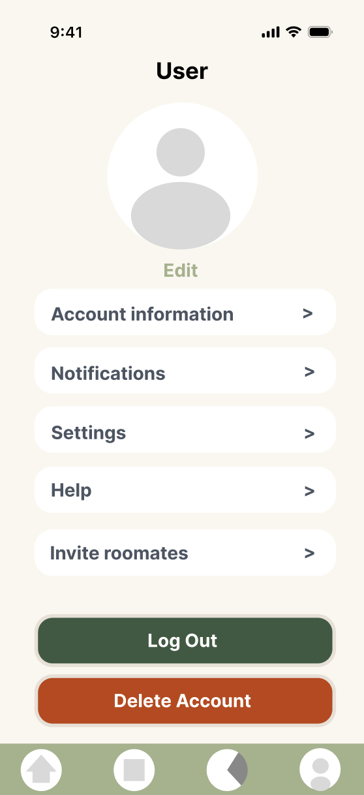
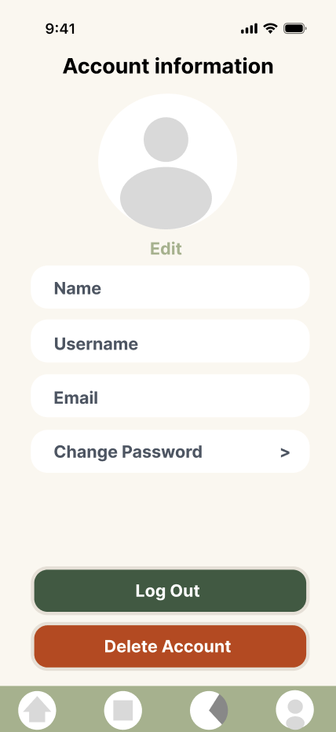
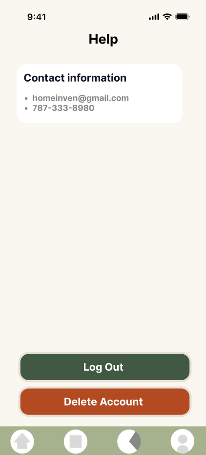

= Create Profile Page UI

Author: @nataliavera6
// Issue: #354

== Purpose:
Design the user interface for the "Profile" page, ensuring it is intuitive, visually appealing, and consistent with the overall design language of the application. The screen should allow users to easily access and manage profile-related options such as settings, account information, notifications, help, and roommate invitations.

== Final product:
Final designs can be viewed in the `docs/design-team/Profile-Page-UI/images` folder.

[%unbreakable]
--
*Design description:*

- The "Profile" page will feature a clean and modern design, with a focus on usability and accessibility.
- All elements were designed following the defined branding and typography guidelines.
- The page will include navigation buttons for the following profile-related sections:
  * Settings
  * Account Info
  * Notifications
  * Help
  * Invite Roommates
- Users will be able to select each button to navigate to its respective page.
- The Notifications section will include a toggle that allows users to enable or disable notifications.
- The Account Info section will allow users to view and manage personal account details.
- The Settings section will provide access to general app preferences.
- The Help section will provide support options and guidance for users.
- The Invite Roommates section will allow users to invite roommates to join the shared household inventory.
- The bottom of the page will include a "Log Out" and "Delete Account" button for users to securely log out of their account.
- the footer of the page includes navigation buttons for Home, Inventory, Budget analyzer and Profile, allowing users to easily switch between main sections of the app.

.Settings Page Design.

.Account Info Page Design.

.Help Page Design.

--