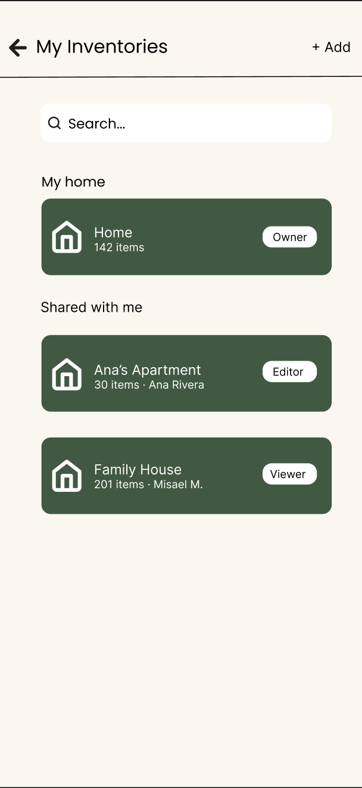
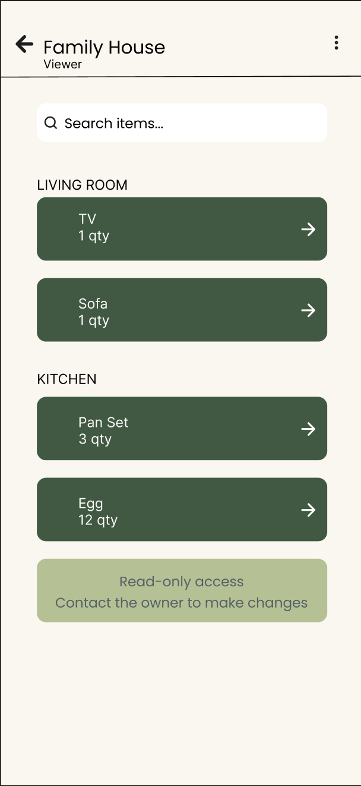
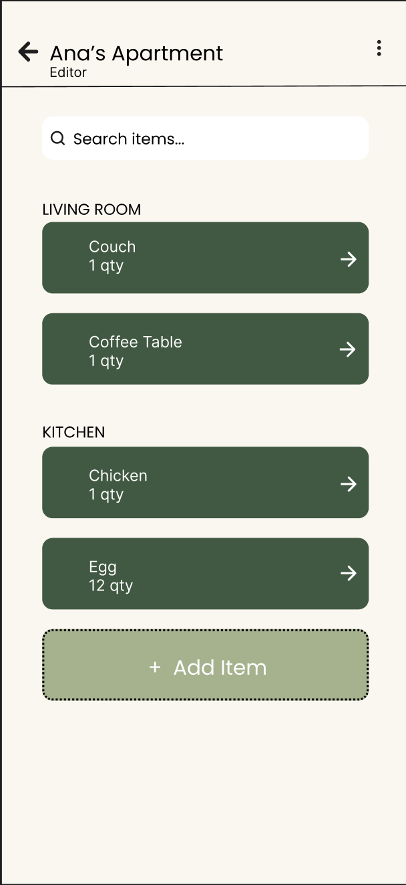
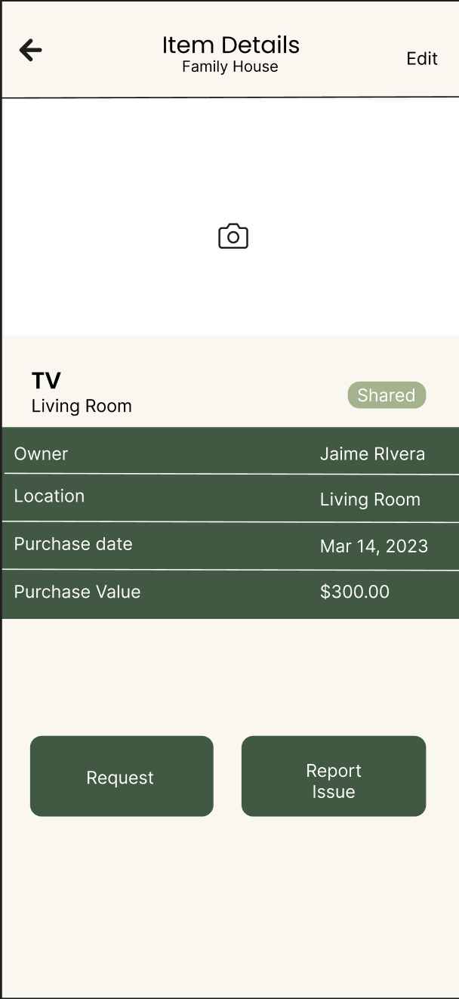

= Shared Inventory Screens — Design Documentation
Home Inventory System — UI Design
@daniellameleroo
:doctype: article
:toc: left
:toc-title: Table of Contents
:sectnums:
:icons: font
:imagesdir: ./
:imagedir: ./

---

== Overview

This section details the design process and screen specifications for the *Shared Inventory* feature of the Home Inventory System. The feature allows household members to view items that belong to the shared household, see item ownership, and access detailed item information by tapping on any item in the list.

---
Shared screens include:

== Task context

As part of the Shared Inventory Screen issue, two primary screens were designed:

* *Shared Inventory List* — displays all household items grouped by room, with ownership indicators per item.
* *Item Detail Page* — a full screen view that opens when a user taps an item, showing its name, photo, owner, location, purchase date, and purchase value.

---

== Design process

=== Step 1 — Define the screen goals

Before designing, the goals of each screen were established:

[cols="1,2", options="header"]
|===
| Screen
| Goal

| Shared inventory list
| Let users quickly browse all shared household items, identify who owns each item, and tap to learn more.

| Item detail page
| Give users a complete view of a single item — who owns it, where it is, when it was bought, and what it is worth.
|===

=== Step 2 — Define the information hierarchy

The following information was prioritized based on the stakeholder perspectives document and the issue requirements:

*Shared inventory list — per item card:*

* Item name (primary)
* Room / category (secondary)
* Owner initials badge (right aligned)

*Item detail page:*

* Item photo (top — largest element)
* Item name and shared status badge
* Owner name with initials avatar
* Location (room)
* Purchase date
* Purchase value
* Action buttons — Request item, Report issue

=== Step 3 — Layout decisions

==== Shared inventory list

* Items are grouped by room using section labels (e.g. LIVING ROOM, KITCHEN).
* Each item is displayed as a card with a left-aligned thumbnail icon, item name, subtitle (room · category), and an owner initials dot on the right.
* The selected or highlighted item uses a blue accent border to indicate focus.
* A tab bar at the bottom provides navigation to Inventory, Members, and Profile.

==== Item detail page

Three layout variants were explored before selecting the final design. See Section 4 for the full comparison.

The selected layout (Variant A — Hero Image) was chosen because:

* The large photo at the top immediately orients the user to the item.
* Key details are grouped in a clean list below the photo.
* Action buttons at the bottom are always reachable without scrolling on standard phone sizes.

=== Step 4 — Action buttons on the detail page

Two action buttons appear at the bottom of the Item Detail screen:

[cols="1,2", options="header"]
|===
| Button
| Behavior

| Request item
| Allows a member to send a request to the owner to borrow or access the item. Secondary style (outlined).

| Report issue
| Allows any member to flag a damage, missing item, or condition concern. Primary style (dark fill).
|===

---

== Layout variants explored

Three layout options were explored for the Item Detail screen before selecting the final design:

[cols="1,1,2", options="header"]
|===
| Variant
| Layout style
| Notes

| A — Hero image (selected)
| Large photo at top, details in rows below, actions at bottom
| Best for visual-heavy inventories. Back button and badge overlaid on photo. Clean separation between photo and content.

| B — Card sections
| Owner card + photo card + info card stacked vertically
| Good for scanability. Content feels modular. Better for long detail lists.

| C — Stat grid
| Thumbnail left of name, 2x2 grid of key stats, activity log below
| Most compact. Best for quick reference. Less emphasis on photo.
|===

*Final selection: Variant A — Hero Image.*

Reason: the photo is the most important orientation cue for a household item, and placing it prominently at the top sets clear context before the user reads any details.

---

== Accessibility considerations

* Owner dots always pair initials text with color — color is never the only identifier.
* Shared/Private badges use both color and text label.
* Action buttons are labeled clearly and large enough for touch targets (minimum 44px height).
* Item detail rows use sufficient contrast between label and value text.

