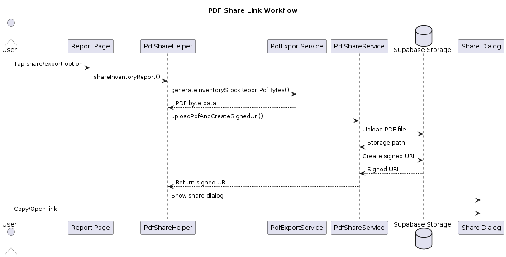

= Sequence Diagram for PDF Export Workflow

== Objective

The purpose of this Lecture Topic Task is to document the workflow used to export reports as PDF files in the Home Inventory system. This task analyzes how the frontend interface, PDF export services, chart generation, and backend services interact during the export process. The documentation improves understanding of the reporting architecture and provides a clear reference for future development and maintenance.

== PDF Export Workflow Analysis

The Home Inventory project includes a reporting system that allows users to export inventory and expenditure reports as PDF documents. The workflow involves several components working together, including the report pages, chart rendering system, PDF export services, optional Supabase storage integration, and device sharing/export functionality.

The workflow begins when the user opens a report page and selects the export option. The application gathers report data, captures chart images when necessary, generates the PDF document, and either exports it locally or uploads it to Supabase Storage for sharing through a signed URL.

The project currently supports:

* Inventory Stock Report PDF generation
* Expenditure Report PDF generation
* Item Usage Rates PDF generation
* Optional cloud sharing through Supabase Storage signed URLs

== Required Information Before Export

Before a report can be successfully exported, the application requires several pieces of information.

=== Inventory Report Export

* Start date
* Page number
* Category summary data
* Item list data
* Optional chart image
* File name
* Report type identifier

=== Expenditure Report Export

* Start date
* End date
* Category expenditure data
* Total expenditure amount
* Optional chart image

=== Item Usage Rates Report

* Date range
* Category usage data
* Optional chart image

== Local PDF Export Workflow

The Expenditure Report page uses a local export workflow that generates the PDF directly on the device.

=== Workflow Description

. The user opens the Expenditure Report page.
. The `ExpenditureCubit` loads expenditure data.
. The user selects the desired date range.
. The user presses the export button located in the bottom toolbar.
. The page captures the pie chart widget as an image using `RenderRepaintBoundary`.
. The page formats category data into structures suitable for PDF generation.
. The `PdfExportService` creates the PDF document.
. The PDF package builds tables, report metadata, and chart sections.
. `Printing.layoutPdf()` opens the device print/export interface.
. The user saves, prints, or shares the generated PDF file locally.

== Sequence Diagram – Local PDF Export Workflow

== PDF Share Link Workflow

The project also includes an optional cloud sharing workflow for inventory reports using Supabase Storage.

Instead of only exporting the PDF locally, the application uploads the generated PDF to Supabase Storage and creates a temporary signed URL that can be shared with other users.

The signed link automatically expires after one hour.

=== Workflow Description

. The user selects the share/export option.
. `PdfShareHelper` receives the report data.
. `PdfExportService` generates PDF bytes.
. `PdfShareService` uploads the PDF to the Supabase `reports` storage bucket.
. Supabase generates a signed URL with an expiration time.
. The application displays a dialog containing sharing options.
. The user may:
.. Copy the link
.. Open the link
.. Close the dialog

== Sequence Diagram – Supabase Share Workflow

== Supabase Backend Integration

The Home Inventory project uses Supabase as part of its backend architecture.

The `SupabaseService` class provides reusable helper methods for:

* Authentication access
* Table streaming
* CRUD operations
* Filtering and search queries
* Real-time database updates

The PDF sharing system specifically uses Supabase Storage to store generated PDF reports temporarily. The uploaded reports are organized using:

* User ID folders
* Report type folders
* Timestamp-based file names

Signed URLs are generated so reports can be accessed securely without making the entire storage bucket public.

== Observations and Findings

The reporting system separates responsibilities clearly across different services.

* Report pages handle user interaction and chart capture.
* Cubits manage report state and filtering.
* `PdfExportService` handles PDF generation logic.
* `PdfShareService` handles Supabase upload and signed URL creation.
* `PdfShareHelper` coordinates the sharing workflow.

This separation improves maintainability and makes the reporting system easier to extend with future report types.

One limitation is that some report data is still hardcoded and marked for future backend integration. The export workflow may also change later as the reporting system continues development.
