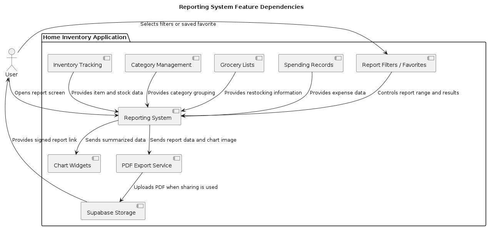

= Review Feature Dependencies in the Reporting System

== Objective

The purpose of this Lecture Topic Task is to review how different Home Inventory features depend on the reporting system. This task documents which parts of the application provide data to reports, how reports use that data, and how reporting connects to the rest of the system.

== Reporting System Overview

The Home Inventory project includes reporting features that help users understand inventory status, item usage, and spending patterns. These reports do not work by themselves. They depend on data from other features in the application, such as inventory tracking, category management, grocery lists, spending records, saved filters, and PDF exporting.

The reporting system acts as a summary layer. It takes existing application data and turns it into charts, tables, and PDF reports that are easier for the user to review.

== Main Feature Dependencies

=== Inventory Tracking

Inventory tracking is one of the main sources of data for the reporting system. It provides information about the items currently stored by the user.

This feature may provide data such as:

* Item name
* Item quantity
* Item category
* Item status
* Expiration or stock information
* Storage location

Reports depend on this data to create inventory summaries, item lists, and stock reports. If inventory data is missing or outdated, the reports may not accurately represent what the user currently has.

=== Category Management

Category management helps organize items and spending records into groups. Reports use categories to summarize data in a clearer way.

This feature may provide data such as:

* Category name
* Category identifier
* Items assigned to each category
* Spending grouped by category

Category data is important because many reports are organized by category. For example, an expenditure report may show how much money was spent on Food, Cleaning, Kitchen, or Hygiene items.

If categories are not assigned correctly, the report results may be harder to understand.

=== Grocery Lists

The grocery list feature is connected to reporting because it can show what items the user plans to buy or needs to restock.

This feature may provide data such as:

* Items marked for purchase
* Needed quantities
* Missing or low-stock items
* Planned shopping items

Reports use this information to show restocking needs or connect grocery planning with inventory status.

=== Spending Records

Spending records are required for expenditure reports. They provide the financial information needed to show how much the user has spent during a selected period.

This feature may provide data such as:

* Purchase amount
* Purchase date
* Category
* Total spending
* Spending per category

The expenditure report depends on this data to calculate totals and percentages. It also uses this data to build charts and tables.

=== Report Filters and Favorites

Report filters allow the user to control what information is shown in a report. These filters may include date ranges, selected pages, or saved report settings.

This feature may provide data such as:

* Start date
* End date
* Page number
* Search query
* Saved favorite filters

Reports depend on filters because the same report can show different results depending on what the user selects. For example, changing the date range changes the data shown in the expenditure report.

=== PDF Exporting

PDF exporting depends on the reporting system because it uses report data to create downloadable or shareable documents.

This feature may use data such as:

* Report title
* Date range
* Chart image
* Table data
* Category totals
* Item data
* Spending totals

The PDF export feature does not create new report data. Instead, it formats existing report information into a PDF file.

The project also supports sharing PDF reports through Supabase Storage. In that workflow, the PDF is uploaded and a signed URL is created so the report can be shared temporarily.

== Dependency Diagram

== Reporting Data Flow

The reporting process starts when the user opens a report screen. The report screen loads the needed information from the related features. For example, an inventory stock report depends on item and category data, while an expenditure report depends on spending and category data.

After the data is loaded, the report screen applies any selected filters. These filters decide what period or subset of data should be displayed. The report then summarizes the data into tables and charts.

If the user exports the report as a PDF, the report data is passed to the PDF export service. The export service creates the PDF using the selected report data, tables, and optional chart image. If the sharing workflow is used, the generated PDF can also be uploaded to Supabase Storage so the user can copy or open a signed link.

== Observations and Findings

The reporting system depends on several other features instead of working alone. This is expected because reports are meant to summarize information already stored in the application.

The strongest dependencies are between reports, inventory tracking, category management, and spending records. These features provide the main data needed for useful reports.

PDF exporting is a secondary dependency because it does not change the report data. It only converts the current report information into a document that can be saved or shared.
