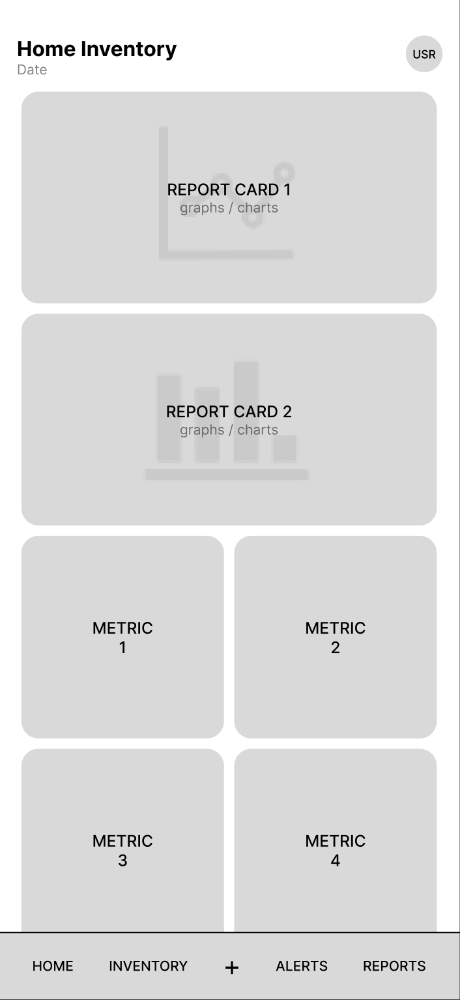
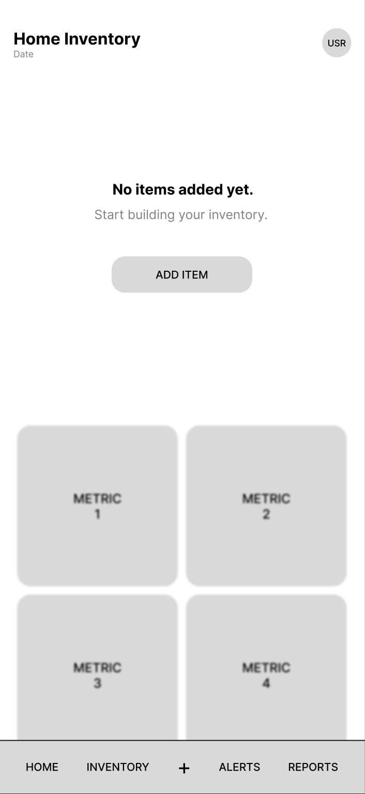
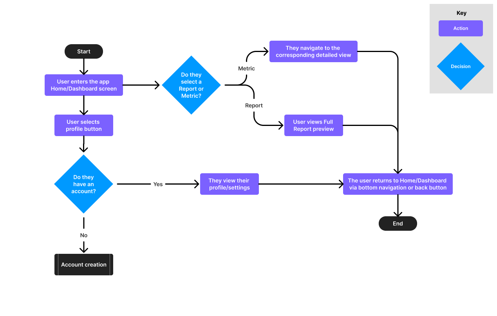

= Defining Home/Dashboard User Experience & Interaction Flow

The Home/Dashboard serves as the primary overview screen of the Home Inventory mobile app. Because multiple teams are contributing features (inventory management, alerts, sharing, budgeting, and reporting), it is critical to clearly define layout structure, interaction behavior, and navigation hierarchy before development begins.

To ensure consistency and alignment across teams, this document defines the Dashboard layout through structured wireframes, example metrics, and a clearly mapped navigation flow that eliminates ambiguity prior to implementation.

== Dashboard States
Two primary states have been identified:

1. *Default State* (inventory data exists)
2. *Empty State* (no inventory items added)

There may also be  *loading* or *error* states. In those cases, the content area would be blurred or disabled, and a simple message or icon would appear in the center. However, these are standard patterns that do not require unique design and are not the focus of this document.

=== Default State
The Default State layout prioritizes visual insight (reports) first, followed by numeric summaries, then navigation. The layout is designed to allow more content below the fold, as shown in the following wireframe.

* Two report preview cards (graphs/charts).
* Four summary metric cards.
* Top right corner button for profile/settings access.
* Persistent bottom navigation.
* Single-column vertical layout with scroll behavior.

=== Empty State
The Empty State appears when no items exist in the system. Instead of showing empty reports, the interface shifts to onboarding and guided action while maintaining the same single-column scroll layout, as shown in the following wireframe.

* Informational message: "No items added yet."
* Primary call-to-action button: "Add Item".
* Four summary metric cards displayed in an inactive state.
* Persistent bottom navigation remains accessible.
* Single-column vertical layout with scroll behavior.

== Proposed Dashboard Metrics
The following metrics are example placeholders based on expected system features. These are subject to refinement once reporting requirements from other teams are finalized.

=== Metric 1: Total Items
* Displays total number of inventory items.
* Provides quick inventory size insight at a glance.
* Tap -> Navigates to Inventory List.

=== Metric 2: Total Inventory Value
* Displays cumulative monetary value of all stored items.
* Supports budgeting and insurance visibility.
* Tap -> Navigates to Value Summary Report.

=== Metric 3: Alerts/Attention Items
* Displays number of low-stock or expiring items.
* Encourages proactive inventory management.
* Tap -> Navigates to Filtered Inventory View (Flagged Items).

=== Metric 4: Categories Tracked
* Displays number of active inventory categories.
* Indicates system organization depth.
* Tap -> Navigates to Category Breakdown Report. 

== Report Preview Cards
The Dashboard includes two large report cards positioned at the top for quick visual insights. These are designed to be dynamic and update based on user data.

=== Report Card 1: Inventory Value Trend
* Line chart preview of value changes over time.
* Tap -> Opens Full Trend Report.

=== Report Card 2: Category Distribution
* Bar or donut chart of items by category.
* Tap -> Opens Category Report View.

== Navigation Structure 
=== Bottom Navigation (Persistent)
* Home/Dashboard
* Inventory
* Add Item (PRIMARY ACTION)
* Alerts
* Reports

This ensures balanced representation across feature teams and allows direct access to high-frequency workflows.

== User Flow Overview
The Dashboard acts as the central navigation hub of the application. Each visible element is actionable and routes the user to a more detailed view.

* Primary navigation is accessible at all times through the bottom navigation bar.
* All screens maintain a clear return path via bottom navigation. No screen results in a dead-end.

== Information Hierarchy
The Dashboard follows a clear visual and functional priority:

1. Report Summary (high-level insights)
2. Summary Metrics (quantitative overview)
3. Persistent Navigation (section switching)

Content is arranged in a single-column vertical layout with scroll behavior. This ensures clarity on small screens and allows room for future utility elements (e.g., search or quick-add actions) without disrupting the overall structure.